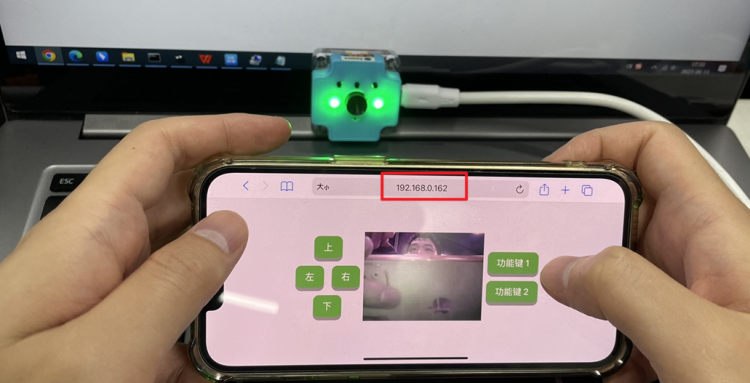

# Sugar Cam使用教學: 遙控模式(進階)

遙控模式是FPV鏡頭的進階模式，能夠實現在網頁顯示實時影像及透過網頁遙控等功能。

請確保模組設定在遙控模式。

<figure><figcaption></figcaption></figure>

### 網頁圖傳控制

在這個模式之下，可以在網頁看到實時影像。

<figure><figcaption></figcaption></figure>

在瀏覽器輸入Sugar Cam的IP地址+:80。例如我的模組IP地址是192.168.0.162的話我就輸入192.168.0.162:80。

```
網頁圖傳同時最多支援1個設備。
```

<figure><figcaption></figcaption></figure>

<figure><figcaption></figcaption></figure>

在頁面上有數個控制鍵，按下按鍵會觸發串口指令。請根據以下表格編寫接收程式。

| 按鍵名稱 | 觸發串口指令     |
| ---- | ---------- |
| 上    | CMD\_UP    |
| 下    | CMD\_DOWN  |
| 左    | CMD\_LEFT  |
| 右    | CMD\_RIGHT |
| 功能鍵1 | CMD\_FUNC1 |
| 功能鍵2 | CMD\_FUNC2 |

### Micro:bit參考程式



### 進階Hacker式玩法

模組的網站頁面可以在index.html作修改，有能力的用家可以透過修改html和javascript達致自己想要的功能。

<div>

<figure><figcaption></figcaption></figure>

 

<figure><figcaption></figcaption></figure>

</div>
