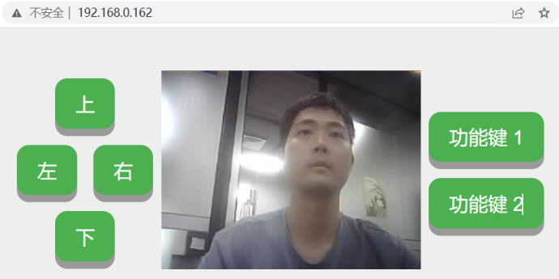
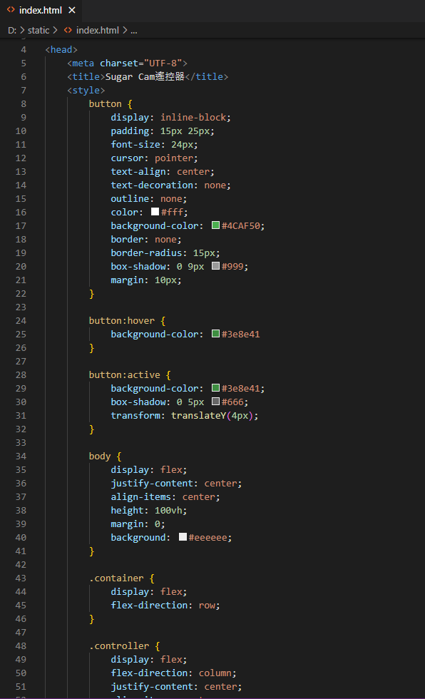
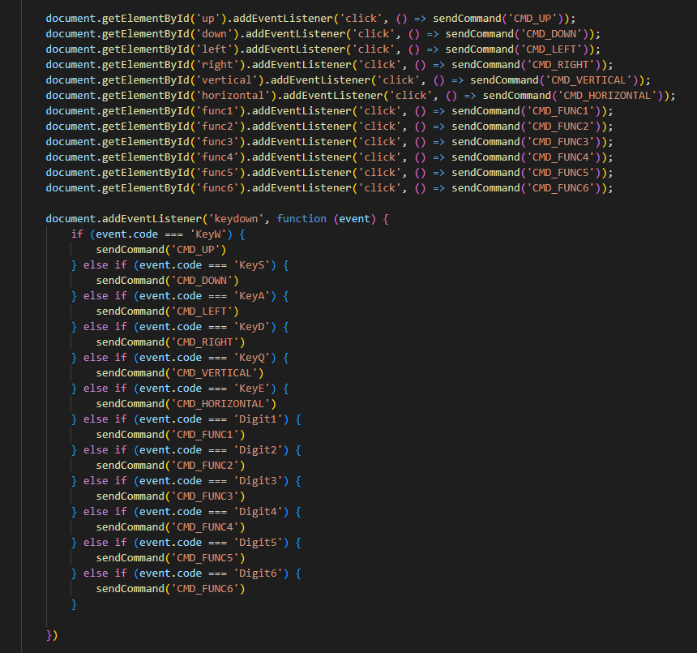

# Sugar Cam功能教學: 網頁介面自訂

### 進階Hacker式玩法

模組的網站頁面可以在index.html作修改，有能力的用家可以透過修改html和javascript達致自己想要的功能。

<figure><figcaption></figcaption></figure>

模組網頁的html檔可以在模組的Static資料夾裡面找到。

<figure><figcaption></figcaption></figure>

<figure><figcaption></figcaption></figure>

<figure><figcaption></figcaption></figure>
