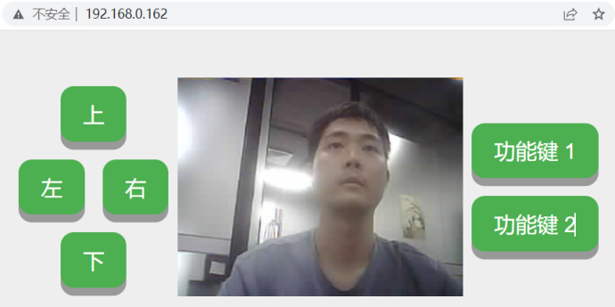
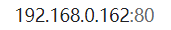
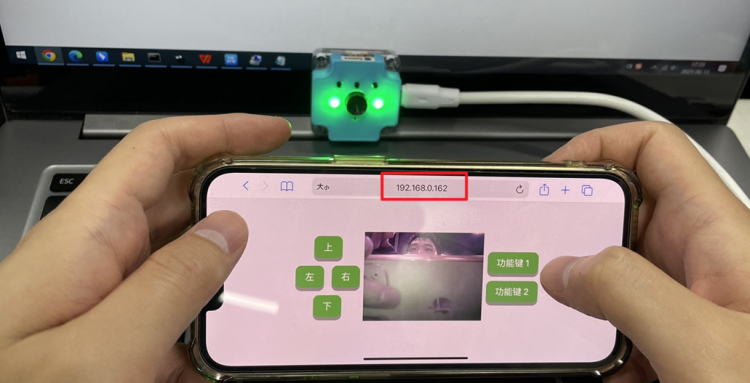

# Sugar Cam功能教學: 網頁圖傳及遙控

### 網頁圖傳控制

在這個模式之下，可以在網頁看到實時影像。

<figure><figcaption></figcaption></figure>

在瀏覽器輸入Sugar Cam的IP地址+:80。例如我的模組IP地址是192.168.0.162的話我就輸入192.168.0.162:80。

```
網頁圖傳同時最多支援1個設備。
```

<figure><figcaption></figcaption></figure>

<figure><figcaption></figcaption></figure>

在頁面上有數個控制鍵，按下按鍵會觸發串口指令。請根據以下表格編寫接收程式。

| 按鍵名稱 | 觸發串口指令     |
| ---- | ---------- |
| 上    | CMD\_UP    |
| 下    | CMD\_DOWN  |
| 左    | CMD\_LEFT  |
| 右    | CMD\_RIGHT |
| 功能鍵1 | CMD\_FUNC1 |
| 功能鍵2 | CMD\_FUNC2 |

### Micro:bit參考程式


