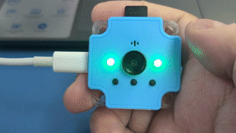

# Sugar Cam使用教學: AI模式(進階)

Sugar Cam亦都支援Teachable Machine驅動的AI圖像辨識功能，請參考以下介紹。

<figure><figcaption></figcaption></figure>

### Teachable Machine功能示範短片



### 刷入Teachable Machine專用固件

首先下載固件更新程式與固件檔案。


進行固件更新會清除原有檔案，有需要的話請保留文件。

更新固件後可逆轉為普通模式，不會永遠只停留在AI模式。




將Sugar Cam連接到電腦。然後按一下Reset，再按一下A鍵，此時Sugar Cam會亮一下紅燈，然後電腦出現UF2\_Sugar的硬碟。

<figure><figcaption></figcaption></figure> <figure><figcaption></figcaption></figure>

打開資料夾裡的Klink.exe。

<figure><figcaption></figcaption></figure>

選擇Modules\&Applications。然後選擇Teachable Machine的Load Plugin。

<figure><figcaption></figcaption></figure>

選擇Firmware的一欄然後按Update Firmware。

<figure><figcaption></figcaption></figure>

下載Teachable Machine小程式。



打開serial\_ws.exe。

<figure><figcaption></figcaption></figure>

點擊Connect，成功的話介面會出現Sugar Cam的畫面。

<figure><figcaption></figcaption></figure> <figure><figcaption></figcaption></figure>

### 切換到普通模式

假如想將Sugar Cam切換到普通模式，只需按先前步驟連接Sugar Cam。

然後在固件刷新程式選擇Sugar Cam並Load Plugin，再按Update Firmware即可。


注意：切換回到普通模式後，Teachable Machine模型也會一併清除。


<figure><figcaption></figcaption></figure>

完成後就可以按照更新固件的方法刷入最新固件。


[..](../)

