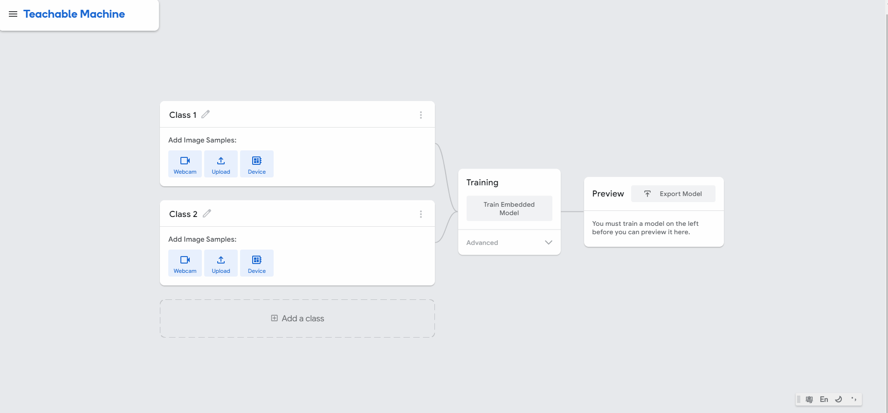
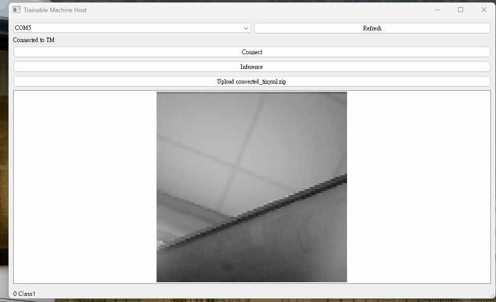

# Sugar Cam功能教學: Teachable Machine模型訓練

前往Teachable Machine的官網。

[Teachable Machine with Google](https://teachablemachine.withgoogle.com/train)

<figure><figcaption></figcaption></figure>

開啟Image Project，選擇Embedded Image Model。

<figure><figcaption></figcaption></figure>

訓練模型時需要使用Sugar Cam的畫像，首先選擇Device然後按Connect，成功的話畫框內會出現Sugar Cam的畫面，此時就可以開始錄入圖像。


這個Teachable Machine最多支援8個分類，每個分類暫時未發現相片上限，一般40\~50張相已經很足夠。


<figure><figcaption></figcaption></figure>

然後按Train Model。完成後可以Connect Device，驗證模型的準確度。

<figure><figcaption></figcaption></figure>

 

<figure><figcaption></figcaption></figure>

 

<figure><figcaption></figcaption></figure>

滿意模型的準確度後就可以匯出模型檔案。按Export Model，然後選擇TensorFlow Lite，選擇TensorFlow Lite for Microcontrollers。按Download my Model。

<figure><figcaption></figcaption></figure>

完成後你會下載一個名為converted\_tinyml.zip的檔案。

<figure><figcaption></figcaption></figure>

然後回到Teachable Machine小程式，將模型檔案上傳到Sugar Cam。完成後再按Connect，Sugar Cam辨認的結果會顯示在小程式下方。

<figure><figcaption></figcaption></figure>
