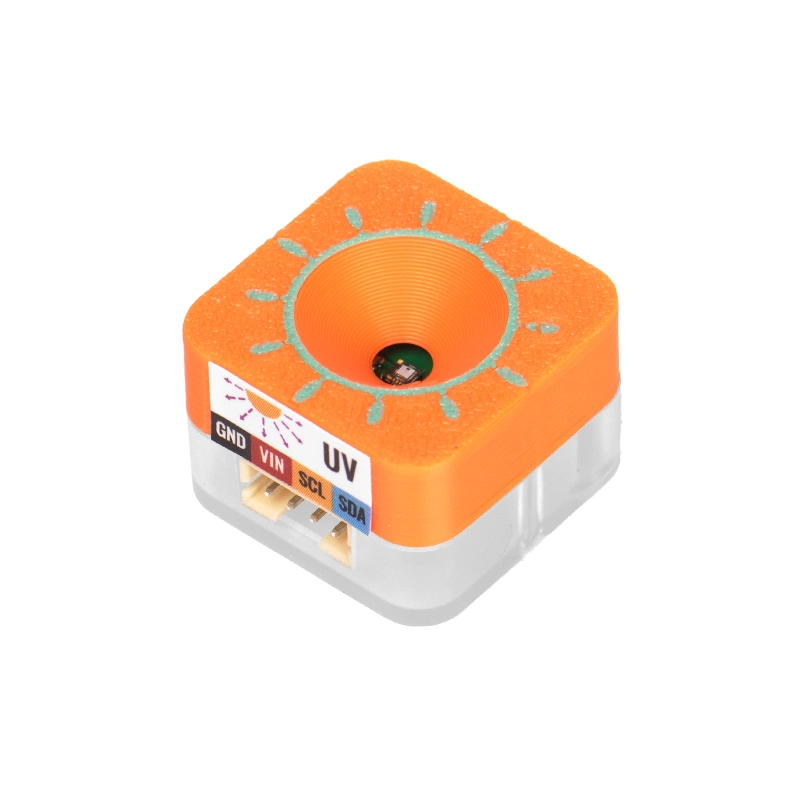
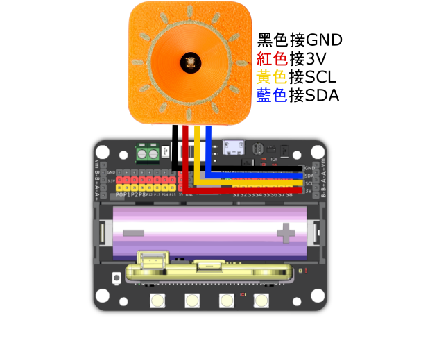

# Sugar 二期紫外線感應模組

<figure><figcaption></figcaption></figure>

這是一個紫外線感應模組，可以檢測到環境的紫外線強度。

模組檢測的紫外線強度僅為參考值，並不是絕對讀數。

## 產品參數：

* 操作電壓：3.3\~5V
* 重量：5.2g
* 尺寸：24 x 24 x 16 mm

## 產品接線

#### Robotbit EDU

<figure><figcaption></figcaption></figure>

#### Robotbit 2.2

<figure><figcaption></figcaption></figure>

## 參考程式

#### MakeCode編程教學

#### 加載Sugar插件：

#### 在擴展頁直接搜尋sugar (sugar已經過微軟認證，可以直接搜尋)

#### 你亦可以用插件地址搜尋

Sugar插件：https://github.com/KittenBot/pxt-sugar

#### [詳細方法](../../programmingplatforms/makecode/kittenbotandmakecode.md)



[參考程式](https://makecode.microbit.org/_3WW1eJTVWcCY)
