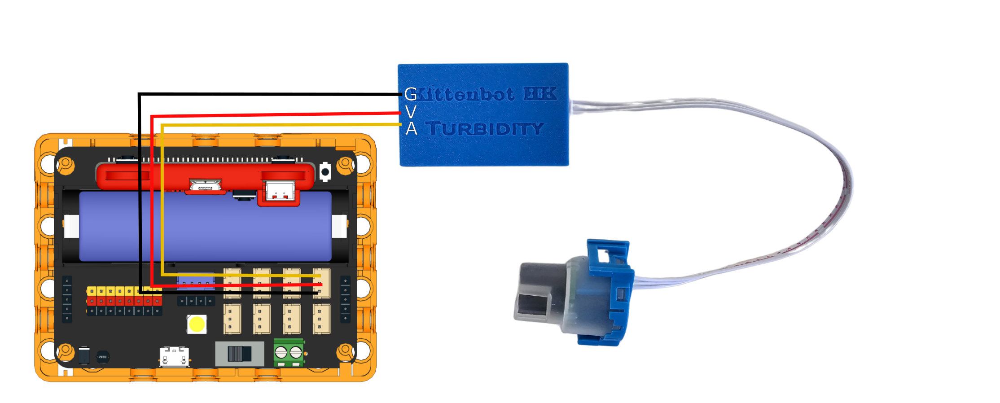
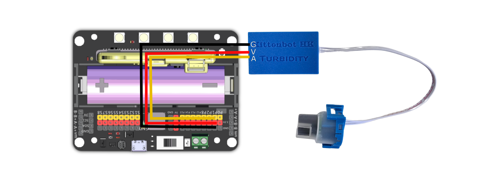

# 污水混濁度感應器

<figure><figcaption></figcaption></figure>

### 污水混濁度感應器[¶](broken-reference)

污水混濁度感應器可以感測水的混濁程度。

### 產品參數[¶](broken-reference)

* 工作電壓：3V\~5V
* 接口：3pin防反插接口
* 工作溫度：5°C\~85°C
* 重量：30g

### 接線教學

### Robotbit EDU

將感應器的A引腳接到Robotbit Edu的接口，將G和V接到電源。


污水混濁度感應器需要類比訊號，如使用Micro:bit，請接到P0/P1/P2；如使用未來板，請接到P0/P1/P2/P12/P14/P15。&#x20;

污水混濁度感應器建議配合水溫感應器一同使用，以下圖表忽略去水溫感應器的接線，請自行參考有關教學。


<figure><figcaption></figcaption></figure>

### Robotbit 2.2

將感應器的A引腳接到Robotbit 2.2的接口，將G和V接到電源。


污水混濁度感應器需要類比訊號，如使用Micro:bit，請接到P0/P1/P2；如使用未來板，請接到P0/P1/P2/P12/P14/P15。&#x20;

污水混濁度感應器建議配合水溫感應器一同使用，以下圖表忽略去水溫感應器的接線，請自行參考有關教學。


<figure><figcaption></figcaption></figure>

### MakeCode 編程教學

<figure><figcaption></figcaption></figure>

#### 在擴展頁直接搜尋Robotbit (Robotbit已經過微軟認證，可以直接搜尋)[¶](broken-reference)

<figure><figcaption></figcaption></figure>

#### 感應器Plus插件：[https://github.com/kittenbothk/pxt-ModulePlus](https://github.com/kittenbothk/pxt-ModulePlus)[¶](broken-reference)

#### 詳細方法[¶](broken-reference)

#### 污水混濁度感應器積木塊：[¶](broken-reference)

<figure><figcaption></figcaption></figure>

#### 污水混濁度感應器編程[¶](broken-reference)

```
污水混濁度感應器可以配合水溫感應器作校正使讀數更加準確。
注意：濁度感應器的頂部沒有防水，請不要將感應器完全浸入水中。
```



[參考程式網址](https://makecode.microbit.org/\_WjmH6zahVTUe)

#### 插件版本與更新[¶](broken-reference)

插件可能會不定時推出更新，改進功能。亦有時候我們可能需要轉用舊版插件才可使用某些功能。

詳情請參考: [Makecode插件版本更換](https://kittenbothk.readthedocs.io/en/latest/Makecode/makecode\_extensionUpdate.html)

### 未來板KittenBlock編程教學[¶](broken-reference)

<figure><figcaption></figcaption></figure>

#### 在硬件欄選擇『未來板』[¶](broken-reference)

<figure><figcaption></figcaption></figure>

#### 污水混濁度感應器積木塊：[¶](broken-reference)

<figure><figcaption></figcaption></figure>

#### 污水混濁度感應器編程[¶](broken-reference)

```
污水混濁度感應器可以配合水溫感應器作校正使讀數更加準確。
注意：濁度感應器的頂部沒有防水，請不要將感應器完全浸入水中。
```

<figure><figcaption></figcaption></figure>

### 示範短片[¶](broken-reference)

#### Micro:bit[¶](broken-reference)



#### 未來板[¶](broken-reference)



