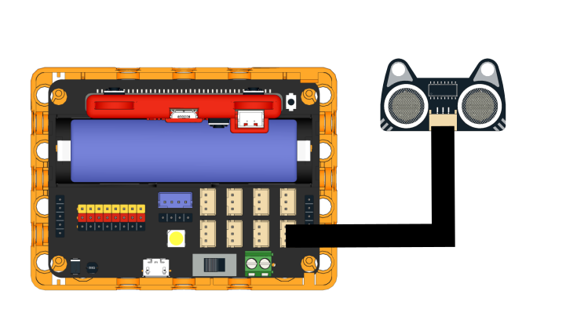
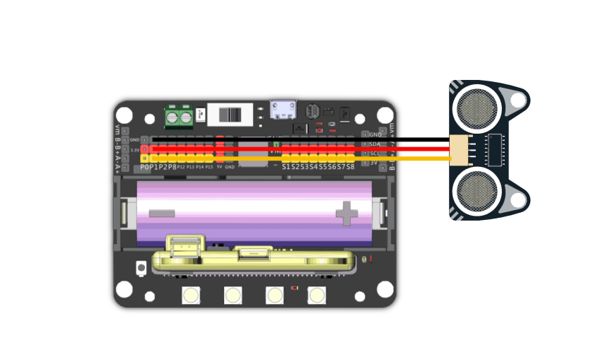

# 貓耳超聲波3.0

貓耳超聲波 (HKBM8014A)

這是一隻超聲波測距模組。

### 產品特點

1. 有別於一般的4線超聲波模組，貓耳超聲波只需要3線，節省引腳資源
2. 支援3V驅動，更適合micro:bit創作環境
3. 兼容樂高結構件，拼砌更直接

### 產品參數

* 工作電壓：3V\~5V
* 工作溫度：-25 \~ +80°C
* 測量角度：30°範圍內
* 測量範圍：5\~300cm（誤差<1cm）
* 接口：杜邦線

### 接線教學

### Robotbit EDU

<figure><figcaption></figcaption></figure>

### Robotbit 2.2

<figure><figcaption></figcaption></figure>

### MakeCode編程教學

#### Microbit:

#### 加載Robotbit插件：

#### 在擴展頁直接搜尋robotbit (robotbit已經過微軟認證，可以直接搜尋)

#### 你亦可以用插件地址搜尋

robotbit插件：https://github.com/KittenBot/pxt-robotbit

#### [詳細方法](../programmingplatforms/makecode/kittenbotandmakecode.md)

#### 超聲波模組積木塊：

**距離檢測編程(有洞版)：**



[參考程式](https://makecode.microbit.org/_48wCLgeCA87g)
