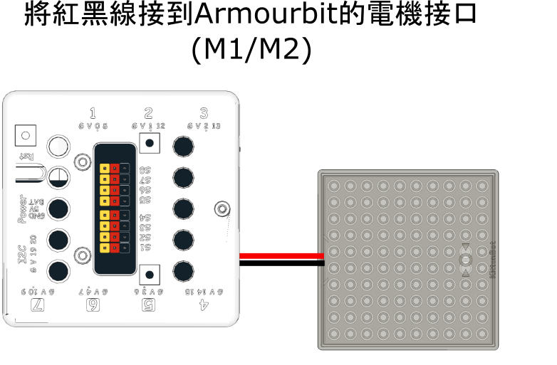
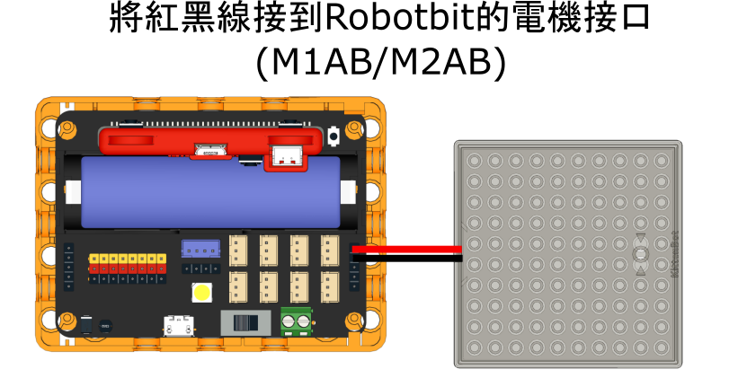

# All in 1水箱連水泵組合

All in 1水箱連水泵組合 (HKBM8015A)


內置浸入式水泵一體化水箱，簡潔方便；水箱頂蓋和底部兼容樂高顆粒件，適合用作智能灌溉、自動洗手機等應用。

### 產品參數

* 工作電壓：3.3V\~6V
* 尺寸：86.5X86.5X98mm
* 額定電流：120mA(3.3V)
* 流量：80L/h
* 最大揚程：0.35M
* 重量：140g
* 膠管長度：60cm
* 接口：紅黑線

### 接線方法

### Armourbit

將電機的紅黑線連接至Armourbit底部的電機接口。

<figure><figcaption></figcaption></figure>

```
沒有嚴格正負極之分，插的方向只會影響電機轉動方向。
```

### Robitbit EDU/2.2

<figure><figcaption></figcaption></figure>

### MakeCode編程教學

#### 此模組可供Microbit和Meowbit使用。

#### ArmourBit

#### 加載Powerbrick插件：

#### 在擴展頁直接搜尋Powerbrick (powerbrick已經過微軟認證，可以直接搜尋)

#### 你亦可以用插件地址搜尋

powerbrick插件：https://github.com/KittenBot/pxt-powerbrick

<figure><figcaption></figcaption></figure>

#### [詳細方法](../programmingplatforms/makecode/kittenbotandmakecode.md)

#### 電機積木塊:


### 電機編程



[參考程式下載](https://bit.ly/PowerbrickM11_01Hex)

[參考程式網址](https://makecode.microbit.org/_RYHivyayYL4q)

#### Robotbit

#### 加載Robotbit插件：

#### 在擴展頁直接搜尋robotbit (robotbit已經過微軟認證，可以直接搜尋)


#### 你亦可以用插件地址搜尋

robotbit插件：https://github.com/KittenBot/pxt-robotbit

#### [詳細方法](../programmingplatforms/makecode/kittenbotandmakecode.md)

#### 電機積木塊:


#### 電機編程



[參考程式網址](https://makecode.microbit.org/_hhF8kxdi3apA)

### Meowbit:

#### 加載robotbit插件：https://github.com/KittenBot/meow-robotbit

#### [詳細方法](../programmingplatforms/makecode/kittenbotandmakecode.md)

#### 電機積木塊:


### 電機編程


[參考程式網址](https://makecode.com/_2z0C8v6XAC5y)

### 示範短片

[](https://www.youtube.com/watch?v=xzTVRHEHfVs)

### 插件版本與更新

插件可能會不定時推出更新，改進功能。亦有時候我們可能需要轉用舊版插件才可使用某些功能。

詳情請參考: [Makecode插件版本更換](../programmingplatforms/makecode/makecodeextupdate.md)

### KittenBlock編程教學


#### 這教學使用Microbit作例子，每款擴展板/主控板的使用教學請參考相應頁面。

#### Armourbit

#### 加載PowerBrick插件

在左上角小貓logo旁邊的硬件欄選擇PowerBrick，加載Microbit與Powerbrick插件。


#### 電機積木塊


#### 電機編程


[參考程式下載](https://bit.ly/PowerbrickM11_01sb3)

#### Robotbit

#### 加載Robotbit插件

在左上角小貓logo旁邊的硬件欄選擇Microbit，加載Microbit與Robotbit插件。


#### 電機積木塊


#### 電機編程


### FAQ

1：為什麼我點擊積木塊沒有反應呢？

首先確保已經連接好Microbit，然後上載韌體再試一試。
