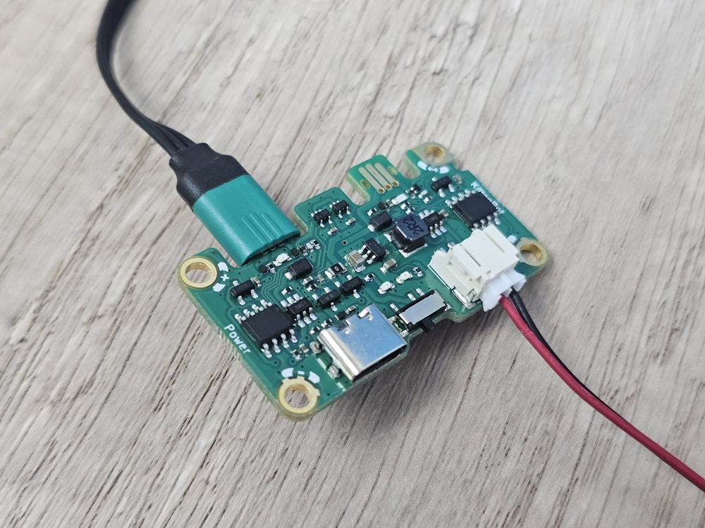

# 溫濕度檢測 參考程式

### MakeCode參考程式



[參考程式](https://makecode.microbit.org/\_LCyMfAaxjMeW)

### 效果示範

可以檢測到環境的溫度和濕度。

<figure><figcaption></figcaption></figure>

### 注意事項

請使用電源板供電時，請將Jacdapter的電源切換撥向上(micro:bit方向)，並且將電源板的開關撥至On。

<figure><figcaption></figcaption></figure>

 

<figure><figcaption></figcaption></figure>

<figure><figcaption></figcaption></figure>

 

<figure><figcaption></figcaption></figure>

a
