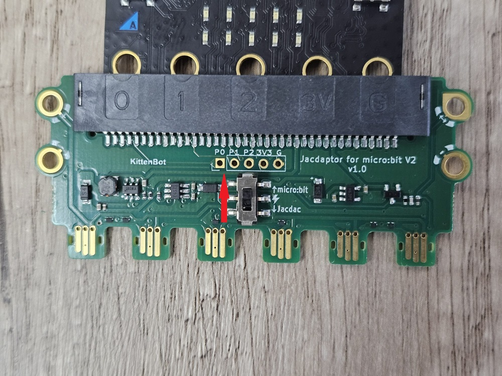
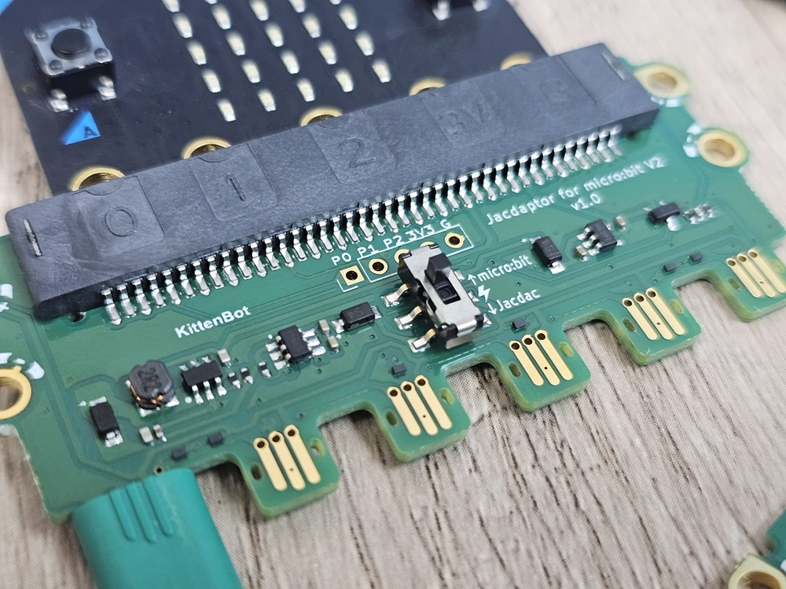
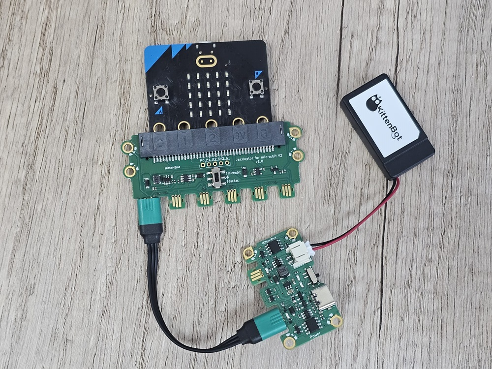
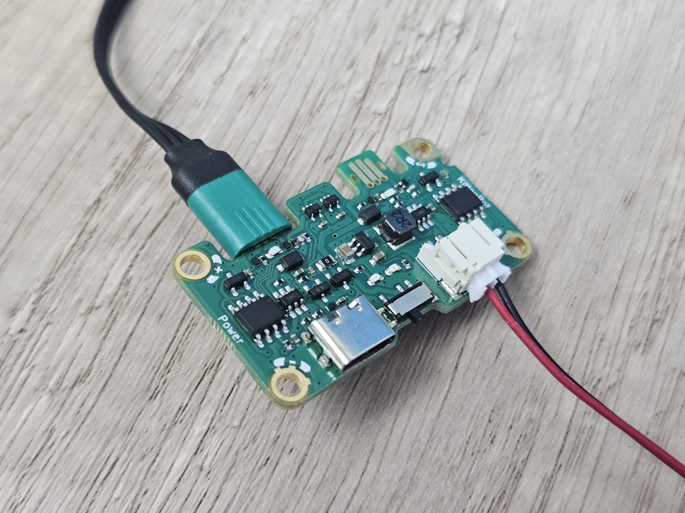

# Jacdapter

Jacdapter是Micro:bit V2專用的Jacdac擴展板，它為Micro:bit帶來6組Jacdac接口。

### 產品參數

### 詳細介紹

1. Micro:bit插座
2. Jacdac標準螺絲孔
3. Micro:bit金手指
4. 電源掣
5. Jacdac接頭
6. Micro:bit引腳接口(需焊接)
7. 產品二維碼

### 電源掣使用說明

當電源掣撥向下，代表電源由Micro:bit供向Jacdac模組。

當電源掣撥向上，代表電源由Jacdac模組供向Micro:bit。

### 使用教學

#### 將Micro:bit插在插座上

### 注意事項

請使用電源板供電時，請將Jacdapter的電源切換撥向上(micro:bit方向)，並且將電源板的開關撥至On。

<figure><figcaption></figcaption></figure>

 

<figure><figcaption></figcaption></figure>

<figure><figcaption></figcaption></figure>

 

<figure><figcaption></figcaption></figure>

a
