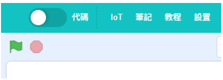

# 3.1 AI鑑別器模型訓練

### 準備訓練程式

### 數據線連接

使用USB線將未來板Lite連接到電腦，並將未來板Lite的電源開關撥向開。

<figure><figcaption></figcaption></figure>

### 編程準備

首先前往KittenBlock編程平台。



<figure><figcaption></figcaption></figure>

在硬件欄選擇未來板Lite AI。

<figure><figcaption></figcaption></figure>

電腦上面就會出現一個USB Drive，我們可以看到未來板Lite上面的檔案。

<figure><figcaption></figcaption></figure>

在右面的選項欄，可以看到代碼的切換鍵，點一下按鍵，頁面就會出現一個輕巧的Python編輯器。

<figure><figcaption></figcaption></figure>

<figure><figcaption></figcaption></figure>
