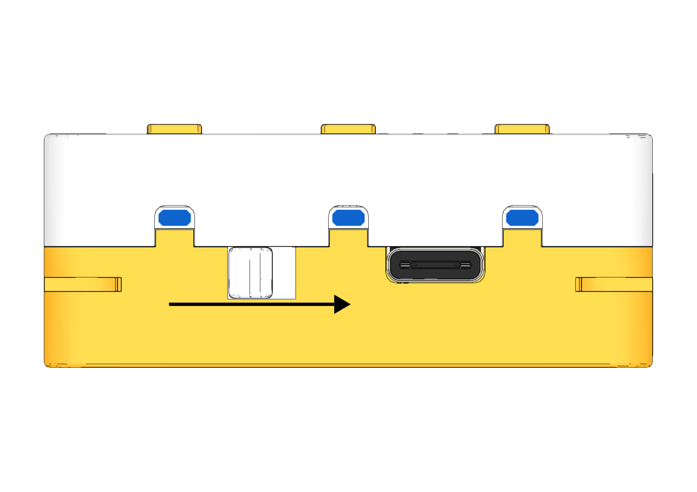

# 1. AI鑒別器中華瀕危物種上手即玩

## 程式選擇教學

未來板Lite已經預載AI鑒別器的程式，學生只須選擇相應程式即可。



程式選擇步驟:

1. 打開電源。

<figure><figcaption></figcaption></figure>

2. 在介面中可以按A鍵和B鍵選擇功能，選擇右邊的運行程序，然後按M鍵確認。
3. 進入頁面後會看到所有的預載程式，使用A和B鍵選擇想啟動的程式，然後按M鍵，未來板就會啟動所選程式。

<figure><figcaption></figcaption></figure> <figure><figcaption></figcaption></figure> <figure><figcaption></figcaption></figure>

## 1. 中華瀕危物種AI鑒別器

### 程式使用教學


AI鑒別器程式需要使用WiFi，請預先準備WiFi熱點。
\
預設WiFi登入資料:
\
SSID: hello
\
Password: 12345678


打開「species\_run.py」。

未來板會自動連接到WiFi網絡。

<figure><figcaption></figcaption></figure>

KOI 2會自動載入先前訓練的AI模型。
\
按未來板的A鍵即可進行辨認。

<figure><figcaption></figcaption></figure>

未來板會顯示辨認到的動物名稱。

按未來板的B鍵，生成式AI就會生成一段文字介紹該動物並以粵語朗讀出來。

<figure><figcaption></figcaption></figure>

<figure><figcaption></figcaption></figure>

按下中間的M鍵，未來板就會顯示Listening。向未來板說出你的問題，未來板會將進行語音辨識。

<figure><figcaption></figcaption></figure>

<figure><figcaption></figcaption></figure>

生成式AI就會生成出答案並以粵語朗讀出來。

<figure><figcaption></figcaption></figure>

### 更改WiFI登入資料

如需更改WiFi的登入資料，請打開wifi.txt然後輸入新的SSID和密碼，兩者用逗號( , )分隔。

<figure><figcaption></figcaption></figure>

<figure><figcaption></figcaption></figure>
