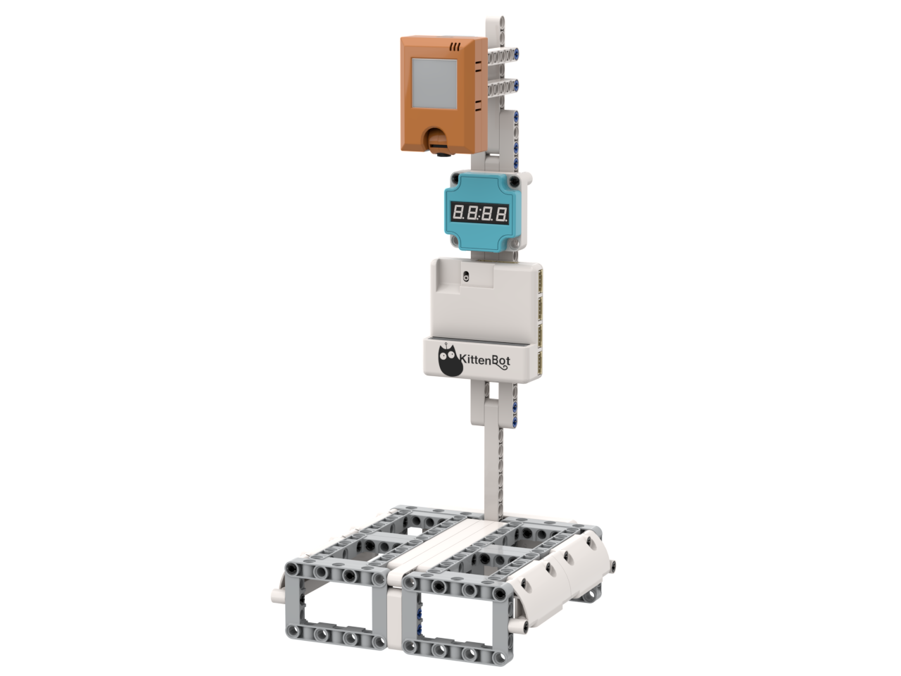

# AI無人商店系統

<figure><figcaption></figcaption></figure>

## 產品特色

* 圖像化編程
* 以學生熟悉的自助付款系統教導AI更貼切
* 積木結構培養學生動手能力

## 產品內容

* Armourbit連電池盒 x1
* AI鏡頭 KOI2 x1
* 數碼顯示模組 x1
* 18650鋰電池 x1
* 積木包 x1
* 連接線

## 示範短片



## 搭建說明書



## 參考接線

<figure><figcaption></figcaption></figure>

## 參考程式


