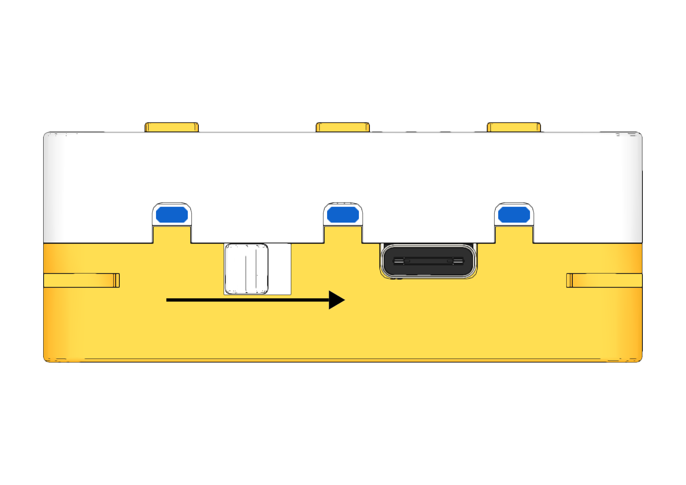
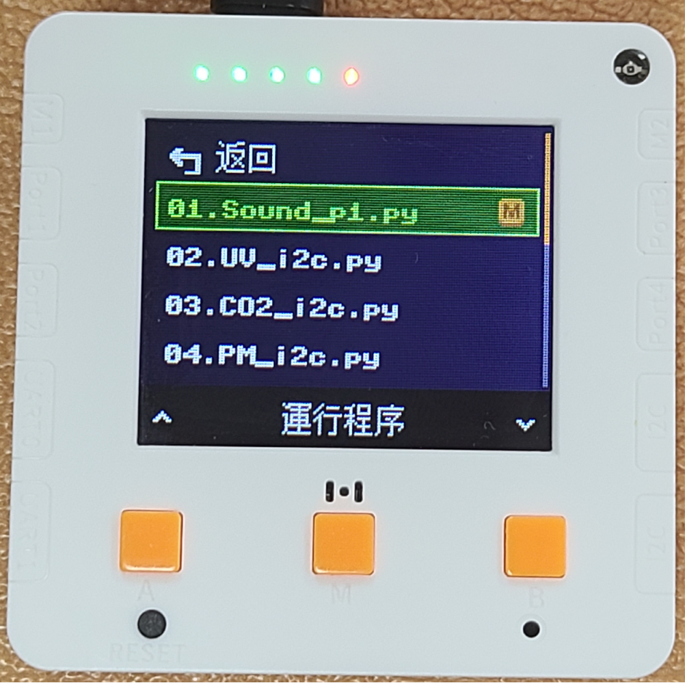

# AI鑒別器快速開始

## 程式選擇教學

未來板Lite已經預載AI鑒別器的程式，學生只須選擇相應程式即可。



程式選擇步驟:

1. 打開電源。

<figure><figcaption></figcaption></figure>

2. 在介面中可以按A鍵和B鍵選擇功能，選擇右邊的運行程序，然後按M鍵確認。
3. 進入頁面後會看到所有的預載程式，使用A和B鍵選擇想啟動的程式，然後按M鍵，未來板就會啟動所選程式。

<figure><figcaption></figcaption></figure> <figure><figcaption></figcaption></figure> <figure><figcaption></figcaption></figure>

## 1. 模型訓練

打開「koi\_train.py」。

<figure><figcaption></figcaption></figure>

1. 未來板Lite會顯示現時的標籤，例如GiantPanda，這是現時要訓練的圖像。
2. 將KOI 2對準圖片然後按A鍵，KOI 2就會錄入數據，將此圖像標籤為GiantPanda。
3. 可以在不同角度距離多錄入數張，令模型更準確。
4. 重複以上步驟直至訓練好所有該標籤的圖片。

<figure><figcaption></figcaption></figure> <figure><figcaption></figcaption></figure>

1. 按下B鍵，未來板就會跳至下一個標籤。
2. 重複以上訓練步驟，訓練所有動物圖片。

<figure><figcaption></figcaption></figure>

完成訓練所有圖片之後，按中間的M鍵就可以將模型儲存下來。儲存成功的話KOI 2會顯示save successfully的畫面。

<figure><figcaption></figcaption></figure>

## 2. AI鑒別器

打開「species\_run.py」。

<figure><figcaption></figcaption></figure>
