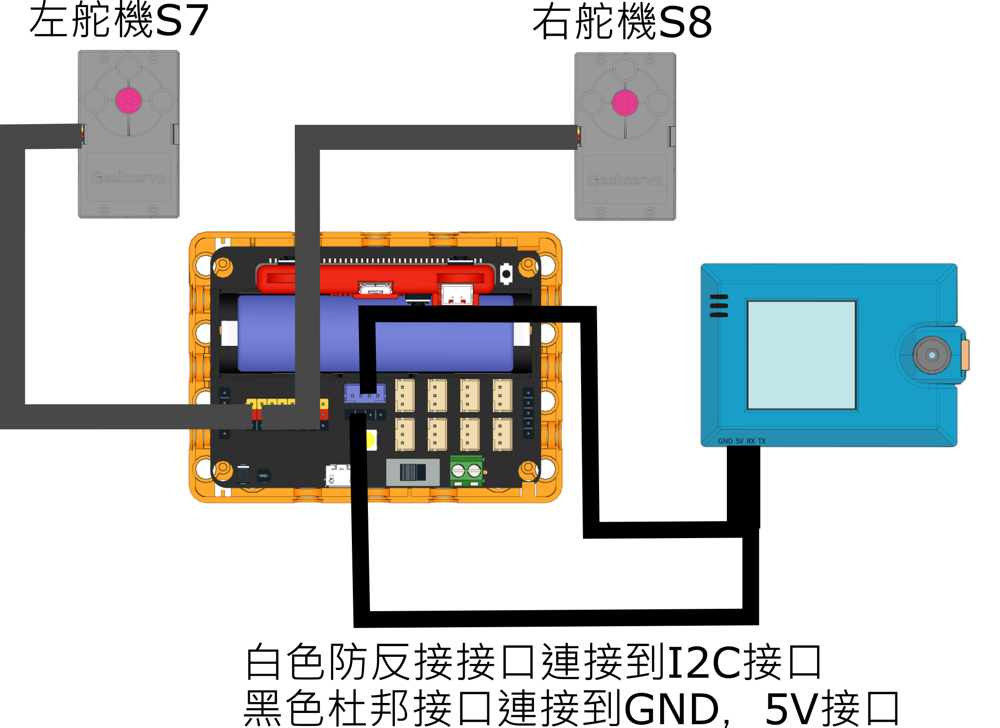

# 範例程式

## 接線教學

<figure><figcaption></figcaption></figure>

## KOI 2圖像分類模型訓練



<figure><figcaption></figcaption></figure>



## AI鑑別器





### 示範教學

#### 1. 打開wifi.txt,填入wifi的登入資料


使用逗號 , 分隔ssid和密碼,ssid和密碼不可以有空格


<figure><figcaption></figcaption></figure>

### 2. 在未來板Lite啟動species\_run.py

### 3. 打開未來板Lite的胖虎編程平台


[bunfu.md](../../mcu/liteai/bunfu.md)

