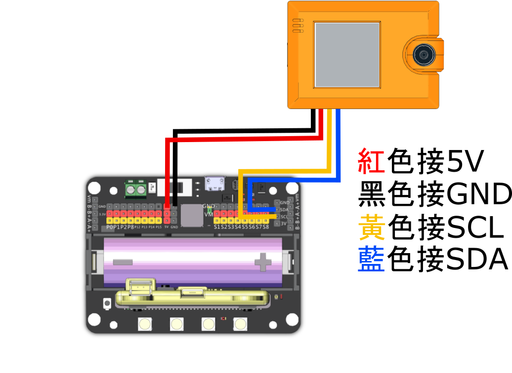

# KOI AI 氣墊球

<figure><figcaption></figcaption></figure>

AI氣墊球機械人會自動追蹤圓球並防守龍門，結合了人工智能技術和玩樂元素。

學生可以透過與KOI人工智能競技，從遊戲中了解現今機器視覺的原理，激發對人工智能的興趣。

更高階的學生更可以透過Python編程編寫自己的AI氣墊球機械人。

### 搭建說明書



[下載說明書](https://www.canva.com/design/DAGS4jnuzC0/A3nRENty2-1jcZox0AfJkA/view?utm_content=DAGS4jnuzC0\&utm_campaign=designshare\&utm_medium=link\&utm_source=editor)

### 接線圖

### KOI接線圖

<figure><figcaption></figcaption></figure>

### 舵機接線圖

<figure><figcaption></figcaption></figure>

### 套件內容

1. Robotbit 2.2連底座 \*1
2. KOI 2 AI鏡頭 \*1
3. GeekServo 2KG灰色舵機 \*2
4. 積木件 \*1套
5. 氣墊球機 \*1
6. KOI連接線 \*1
7. 1m USB線 \*1
8. 18650鋰電池 \*1

### 額外所需物資

* USB移動式電源 或
* USB 5V充電器

### 操作教學

打開Robotbit電源後，KOI會追蹤並阻擋紅色球片。

### 示範短片



### 參考程式

出廠時KOI已經預載參考程式，如有需要請用KittenCode載入此py檔上載至KOI。



<pre class="language-python"><code class="lang-python"><strong>import sensor, image, time, lcd, utime
</strong>import math, ustruct
from maix import KPU, GPIO, I2S
from machine import UART, I2C

from fpioa_manager import fm

import gc

grid = [
    (56,74),(96,74),(137,72),(179,70),(220,68),(262,67),
    (52,113),(94,116),(136,112),(179,109),(222,107),(264,104),
    (51,157),(93,156),(139,154),(181,151),(227,150),(269,147),
]

PCA9685_ADDRESS    = 0x40
MODE1              = 0x00
MODE2              = 0x01
SUBADR1            = 0x02
SUBADR2            = 0x03
SUBADR3            = 0x04
PRESCALE           = 0xFE
LED0_ON_L          = 0x06
LED0_ON_H          = 0x07
LED0_OFF_L         = 0x08
LED0_OFF_H         = 0x09
ALL_LED_ON_L       = 0xFA
ALL_LED_ON_H       = 0xFB
ALL_LED_OFF_L      = 0xFC
ALL_LED_OFF_H      = 0xFD

S1 = 0x1
S2 = 0x2
S3 = 0x3
S4 = 0x4
S5 = 0x5
S6 = 0x6
S7 = 0x7
S8 = 0x8

RESTART            = 0x80
SLEEP              = 0x10
ALLCALL            = 0x01
INVRT              = 0x10
OUTDRV             = 0x04
RESET              = 0x00

positions = [
    [240, 195], [235, 175], [220, 155], [210, 135], [190, 125], [160, 115],
    [260, 190], [250, 165], [235, 145], [220, 125], [195, 105], [170, 95],
    [285, 190], [275, 170], [250, 140], [220, 105], [195, 85], [170, 70]
]

class RobotBit:

    def __init__(self):
        self.address = PCA9685_ADDRESS
        self.i2c = I2C(I2C.I2C0, freq=400000, scl=17, sda=14, addr_size=7)
        self.i2c.writeto(self.address, bytearray([MODE1, RESET])) # reset not sure if needed but other libraries do it
        self.i2c.writeto(self.address, bytearray([MODE1, RESET]))
        self.i2c.writeto(self.address, bytearray([MODE2, OUTDRV]))
        self.i2c.writeto(self.address, bytearray([MODE1, ALLCALL]))
        time.sleep_ms(5)
        mode1 = self.i2c.readfrom_mem(self.address, MODE1, 1)[0]
        mode1 = mode1 &#x26; ~SLEEP  # wake up (reset sleep)
        self.i2c.writeto(self.address, bytearray([MODE1, mode1]))
        time.sleep_ms(5)
        self.set_pwm_freq(50)
        self.inited = True
    
    def set_pwm_freq(self, freq_hz):
        """Set the PWM frequency to the provided value in hertz."""
        prescaleval = 25000000.0    # 25MHz
        prescaleval /= 4096.0       # 12-bit
        prescaleval /= float(freq_hz)
        prescaleval -= 1.0
        prescale = int(math.floor(prescaleval + 0.5))
        oldmode = self.i2c.readfrom_mem(self.address, MODE1, 1)[0]
        newmode = (oldmode &#x26; 0x7F) | 0x10    # sleep
        self.i2c.writeto(self.address, bytearray([MODE1, newmode]))
        self.i2c.writeto(self.address, bytearray([PRESCALE, prescale]))
        self.i2c.writeto(self.address, bytearray([MODE1, oldmode]))
        time.sleep_ms(5)
        self.i2c.writeto(self.address, bytearray([MODE1, oldmode | 0x80]))

    def set_pwm(self, channel, on, off):
        """Sets a single PWM channel."""
        if not self.inited:
            self.initRobotBit()
        if on is None or off is None:
            data = self.i2c.mem_read(4, self.address, LED0_ON_L+4*channel)
            return ustruct.unpack('&#x3C;HH', data)
        self.i2c.writeto(self.address, bytearray([LED0_ON_L+4*channel, on &#x26; 0xFF]))
        self.i2c.writeto(self.address, bytearray([LED0_ON_H+4*channel, on >> 8]))
        self.i2c.writeto(self.address, bytearray([LED0_OFF_L+4*channel, off &#x26; 0xFF]))
        self.i2c.writeto(self.address, bytearray([LED0_OFF_H+4*channel, off >> 8]))

    def geekServo(self, index, degree):
        # 50hz: 25,000 us
        # 500~2650us->0~360
        # v_us = degree * 50 / 9 +500
        v_us = 200/36*degree + 500  # calibrated
        value = int(v_us*4096/20000)
        self.set_pwm(index+7, 0, value)

class AirHockey:

    def __init__(self):
        self.thresholdMap = {
            'red': [30,100,15,127,15,127],
            'blue': [0,50,-64,64,-127,-20],
            'red2': [29,98,-9,57,0,47]
        }
        sensor.reset()
        sensor.set_pixformat(sensor.RGB565)
        sensor.set_framesize(sensor.QVGA)
        lcd.init()
        lcd.rotation(0)
        lcd.clear()
        sensor.set_vflip(True)
        sensor.run(1)
        sensor.skip_frames(time = 2000)
        self.displayGrid()
        self.cachedPosition = []
        self.t0 = time.ticks_ms()
        self.lastIndex = -1
        self.robo = RobotBit()

    def displayGrid(self):
        self.img = sensor.snapshot()
        for i in range(len(grid)):
            self.img.draw_cross(grid[i][0],grid[i][1],5,color=(0,255,0))
        lcd.display(self.img)

    def colorCalibrate(self, key, r=[(320//2)-(50//2), (240//2)-(50//2), 50, 50]):
        for i in range(60):
            self.img = sensor.snapshot()
            self.img.draw_string(40, 0, "put the color\nin the rect", scale=2,color=(0,255,0))
            self.img.draw_rectangle(r)
            lcd.display(self.img)

        threshold = [50, 50, 0, 0, 0, 0] # Middle L, A, B values.
        for i in range(60):
            self.img = sensor.snapshot()
            self.img.draw_string(40, 0, "be learning...", scale=2,color=(0,255,0))
            hist = self.img.get_histogram(roi=r)
            lo = hist.get_percentile(0.01) # Get the CDF of the histogram at the 1% range (ADJUST AS NECESSARY)!
            hi = hist.get_percentile(0.99) # Get the CDF of the histogram at the 99% range (ADJUST AS NECESSARY)!
            # Average in percentile values.
            threshold[0] = (threshold[0] + lo.l_value()) // 2
            threshold[1] = (threshold[1] + hi.l_value()) // 2
            threshold[2] = (threshold[2] + lo.a_value()) // 2
            threshold[3] = (threshold[3] + hi.a_value()) // 2
            threshold[4] = (threshold[4] + lo.b_value()) // 2
            threshold[5] = (threshold[5] + hi.b_value()) // 2
            for blob in self.img.find_blobs([threshold], pixels_threshold=100, area_threshold=100, merge=True):
                self.img.draw_rectangle(blob.rect())
                self.img.draw_cross(blob.cx(), blob.cy())
                self.img.draw_rectangle(r)
            lcd.display(self.img)
        self.thresholdMap[key] = threshold
        print(threshold)
    

    def getPosition(self, x, y):
        # calculate the closest grid index
        minDist = 100000
        minIndex = -1
        for i in range(len(grid)):
            dist = (grid[i][0]-x)**2 + (grid[i][1]-y)**2
            if dist &#x3C; minDist:
                minDist = dist
                minIndex = i
        return minIndex
    

    def setPositon(self, index):
        pos = positions[index]
        self.robo.geekServo(S8, pos[1])
        self.robo.geekServo(S7, pos[0])
        
    def colorTrack(self,key='red'):
        cx=-1
        cy=-1
        maxArea = 0
        #([self.thresholdMap[key]], pixels_threshold=100, area_threshold=100, merge=True, margin=10)
        for blob in self.img.find_blobs([self.thresholdMap[key]], pixels_threshold=200, area_threshold=200, merge=True, margin=10):
            self.img.draw_rectangle(blob.rect())
            self.img.draw_cross(blob.cx(), blob.cy())
            cx = blob.cx()
            cy = blob.cy()
            if blob.rect()[2] * blob.rect()[3] > maxArea:
                maxArea = blob.rect()[2] * blob.rect()[3]
        return (cx, cy)

    def tick(self):
        self.img = sensor.snapshot()
        (rx, ry) = self.colorTrack('red')
        if rx == -1:
            self.cachedPosition = []
            lcd.display(self.img)
            self.setPositon(8)
            return
        index = self.getPosition(rx, ry)
        self.img.draw_cross(grid[index][0],grid[index][1],5,color=(0,255,0))
        print(index)
        # print history lines
        for i in range(len(self.cachedPosition)):
            self.img.draw_cross(self.cachedPosition[i][0], self.cachedPosition[i][1],color=(0,100,200))
        lcd.display(self.img)
        self.setPositon(index)
        self.cachedPosition.append((rx,ry))
        if len(self.cachedPosition) > 10:
            self.cachedPosition.pop(0)

    def run(self):
        while True:
            self.tick()
            time.sleep_ms(50)
            gc.collect()

ak = AirHockey()
#ak.colorCalibrate(key='red2')
ak.run()
</code></pre>

#### 舵機校正


