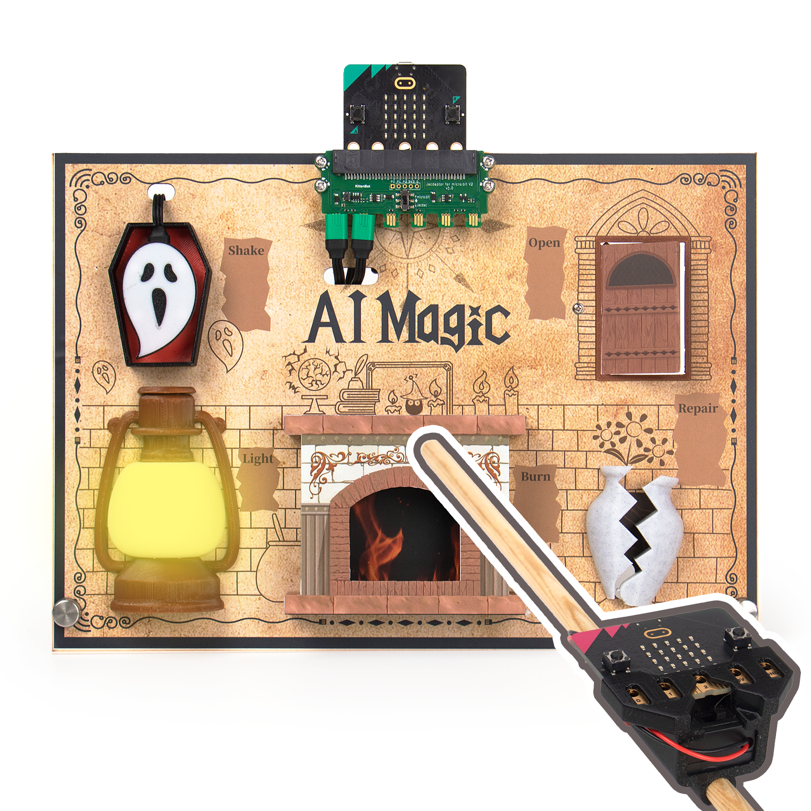

# Micro:bit AI魔杖套件

<figure><figcaption></figcaption></figure>

訓練AI辨識手勢，化身小巫師施展魔咒。魔咒效果透過Jacdac模組活靈活現。

學生代入小巫師角色，學習更投入。配合美觀的道具，展示性更高。

## 套件特色

<figure><figcaption></figcaption></figure>

* 訓練AI模型過程簡易
* 玩法融合AI與魔法，學生更投入
* MakeCode全圖像化編程
* 可自訂咒語
* 道具美觀，展示性高
* 採用Jacdac系列，接線及編程簡單
* 完成的套件可以放入手抽收納盒，方便攜帶及保存

## 套件內容

**電子模組**

* Jacdaptor x1
* Jacdac 電源模組 x1
* Jacdac RGB燈帶模組 x1
  * RGB燈條 x1
* Jacdac 舵機模組 x1
  * 9G 舵機 x2
* Jacdac 震動模組 x1
* Jacdac RGB燈圈 x1
* AAA電池盒 x1

**連接線**

* Micro USB線 x1
* USB C線 x1
* Jacdac 連接線 10cm x3
* Jacdac 連接線 20cm x2

**其他材料**

* 木板 ( 210mm × 297mm × 3mm) x1
* 木棒 ( 300mm, φ8mm) x1
* 3D打印零件包 x1
* 裝飾貼紙 x1
* M3銅柱 x16
* M3螺絲 x32
* M2螺絲 x8
* M1.2x6螺絲 x4
* 螺絲批 x2

## 展示短片



## 產品展示

<figure><figcaption></figcaption></figure>

<figure><figcaption></figcaption></figure>

<figure><figcaption></figcaption></figure>

<figure><figcaption></figcaption></figure>
