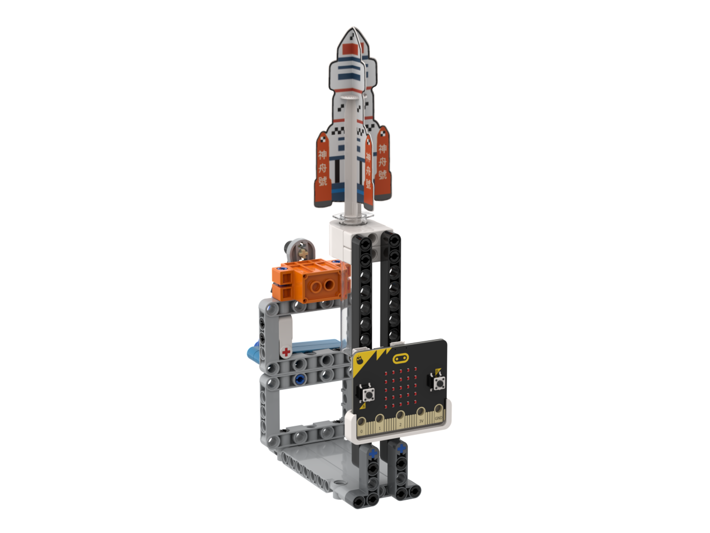
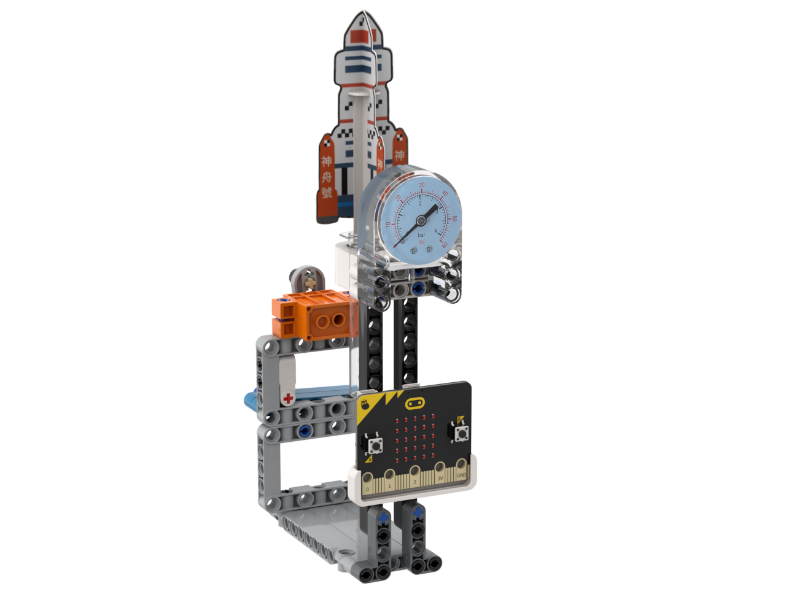

# 氣動火箭發射實驗套件

## 無氣壓計版

<figure><figcaption></figcaption></figure>

## 氣壓計版

<figure><figcaption></figcaption></figure>

## 套件介紹

氣動火箭發射實驗套件是一套集航天、物理、編程的SPACE套件。

同學可以自行搭建火箭發射台與設計火箭圖樣，邁向航天夢。

除了涉及STEM課題之外亦有公民愛國教育的元素。

## 全新SPACE教學概念

SPACE是Science(科學)、Programming(編程)、Arts(藝術)、Country(國家)、Engineering(工程)；這五個課題的縮寫，Kittenbot希望透過此套件將STEAM教育融合到公民愛國教育裏，從而在提升學生的科學探究能力之餘同時培養學生的民族自豪感。

1. **S**cience(科學)
   * 觀察牛頓運動定律當中作用力與反作用力的理論
2. **P**rogramming(編程)
   * 對火箭發射器進行編程，學習驅動馬達等電子零件
3. **A**rts(藝術)
   * 發揮創意，自行設計及繪畫自己的火箭模型
4. **C**ountry(國家)
   * 認識到國家在航天科技的發展及成就，培養民族自豪感
5. **E**ngineering(工程)
   * 體驗活塞及氣泵結構的原理，自己搭建出火箭發射器



## 示範短片





## 套件內容

* GeekServo O360續轉舵機 ×1
* 積木零件包 ×1
* 發射筒 ×1
* 彩色印刷火箭紙樣 ×1
* 黑白DIY火箭紙樣 ×1
* 3D打印零件包 ×1
* 氣壓表 x1(**選配**)
* Robotbit x1(**選配**)
* 拋射角調控器 x1(**選配**)

