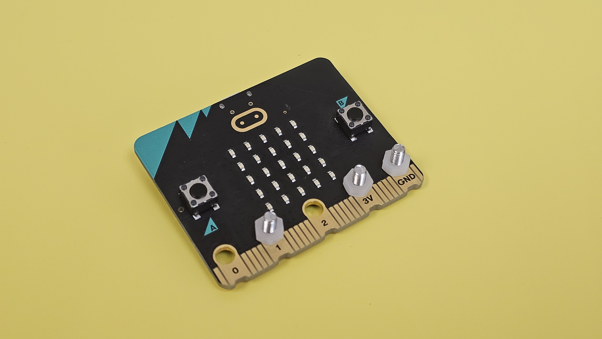

# 搭建說明書與參考程式

## 搭建說明書

### 普通版



### 豪華版



## 接線圖

### 鱷魚夾線

首先將M3螺絲穿到Micro:bit的GND、3V和1的金手指圓孔，然後使用塑膠絲帽固定螺絲。

<figure><figcaption></figcaption></figure>

 

<figure><figcaption></figcaption></figure>

 

<figure><figcaption></figcaption></figure>

將鱷魚夾線夾在螺絲的突出部分。

黃色線夾到1。

紅色線夾到3V。

黑色線夾到GND。

<figure><figcaption></figcaption></figure>

### 氣動軟管接駁(普通版)

使用氣動軟管將氣泵與針筒連接起來。

<figure><figcaption></figcaption></figure>

### 氣動軟管接駁(豪華版)

將氣動軟管連接到T型接駁件的其中1邊，在接駁件的另外兩面分別接駁上針筒與氣壓表。

<figure><figcaption></figcaption></figure>

## 參考程式


