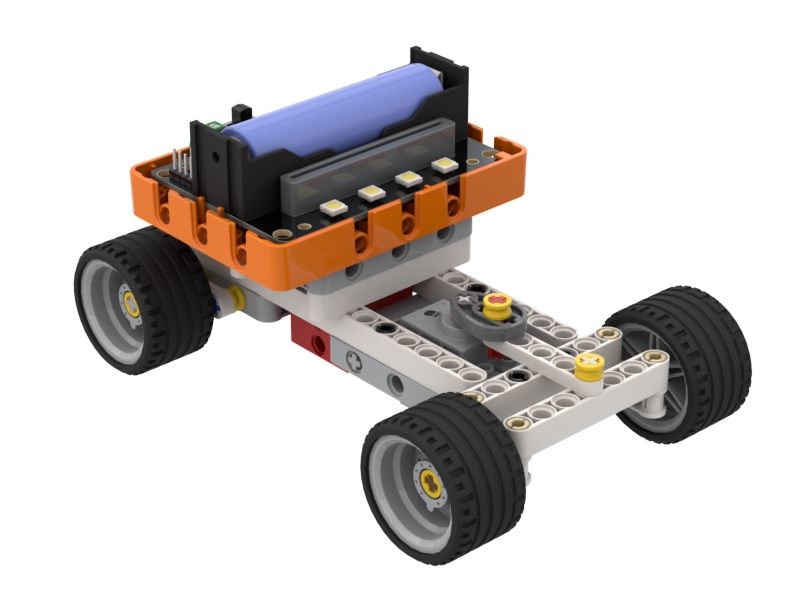
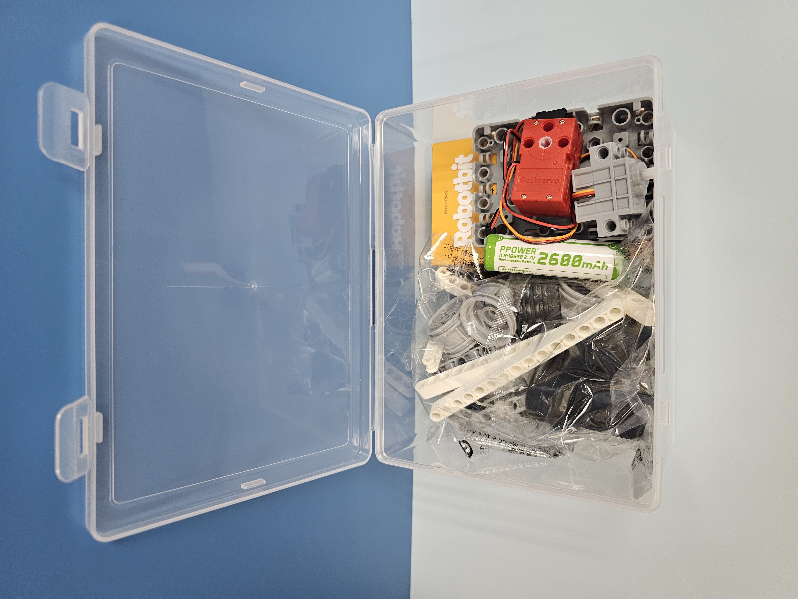
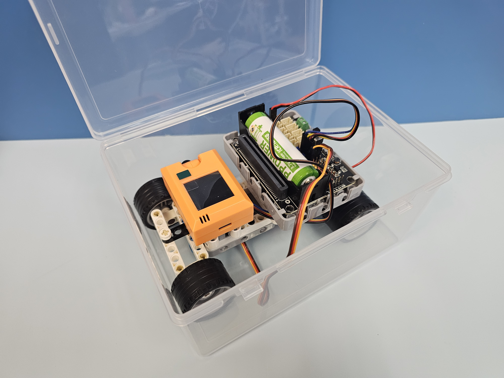
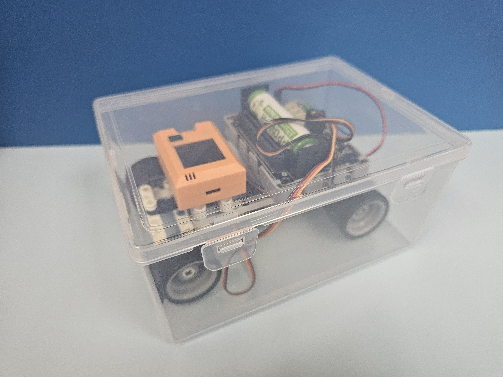

# Robotbit差速車

<figure><figcaption></figcaption></figure>

這是一個擁有仿真結構的編程小車，小車使用單馬達配合差速器驅動與舵機轉向，與真實汽車的結構類似。

## 套件特色

* 仿真機械車底盤
  * 配有差速器傳動系統及仿真轉向結構
  * 同學透過組裝小車可以學習到汽車的運作原理
* 附隨收納盒
  * 組裝完成的小車可以收納到盒子裡面

## 套件內容

* Robotbit EDU擴展板 \*1
* Geekservo 2KG 馬達 \*1
* Geekservo 9G 舵機 \*1
* 積木包 \*1
* 18650鋰電池 \*1
* 塑膠收納盒 \*1

## 套件包裝

<figure><figcaption></figcaption></figure>

 

<figure><figcaption></figcaption></figure>

<figure><figcaption></figcaption></figure>

 

<figure><figcaption></figcaption></figure>

## 說明書與參考程式


[rc.md](rc.md)

