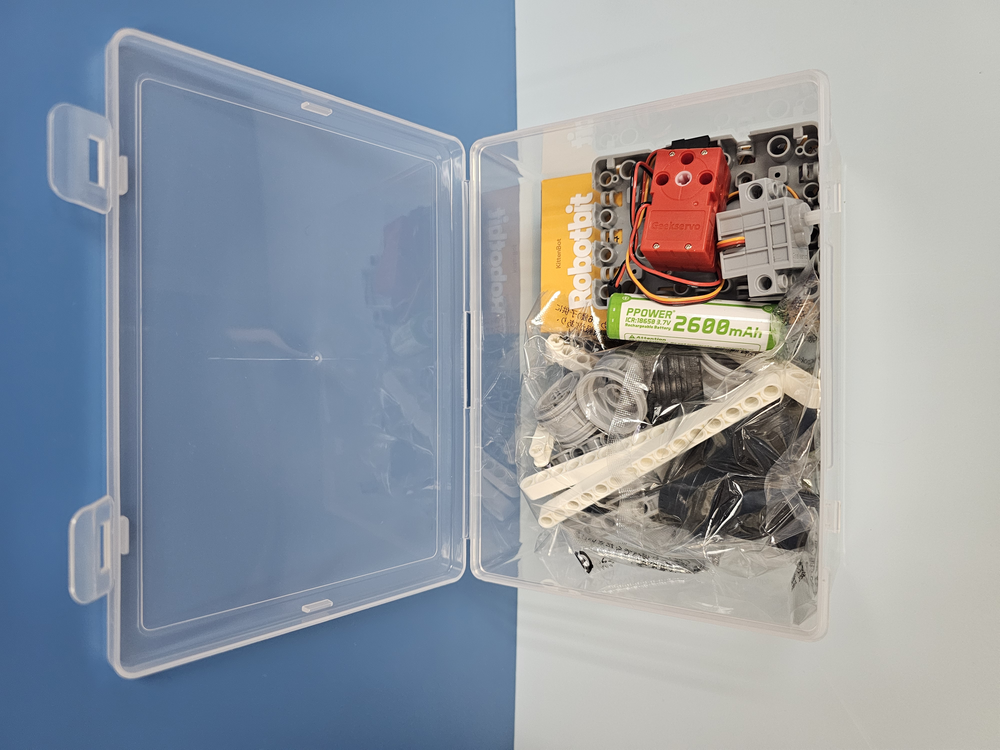
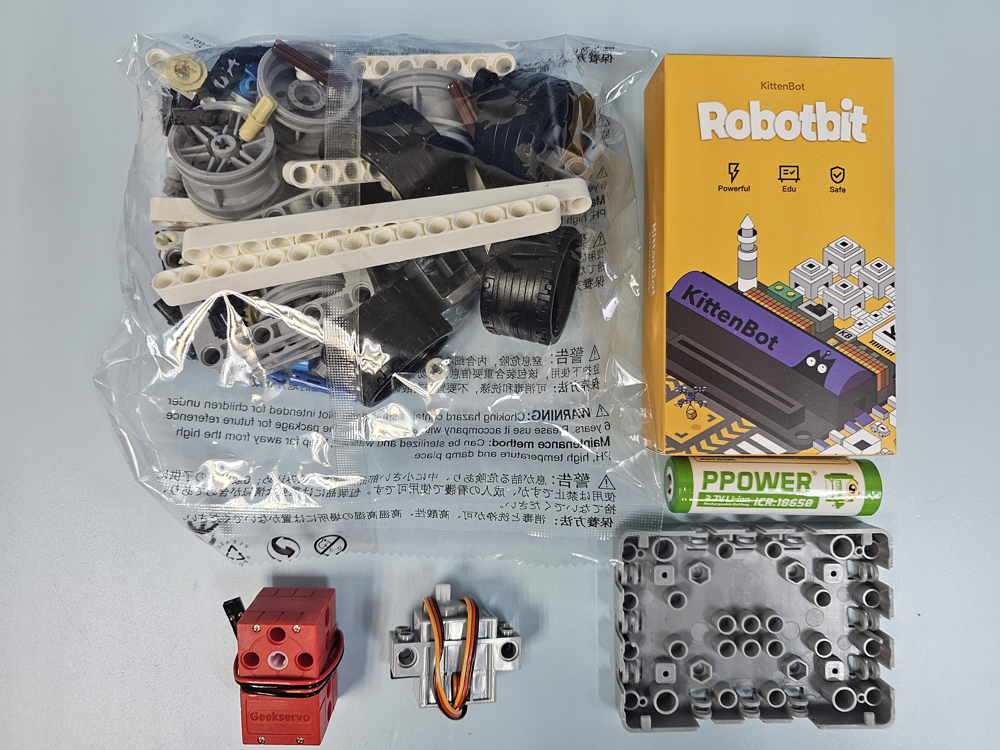
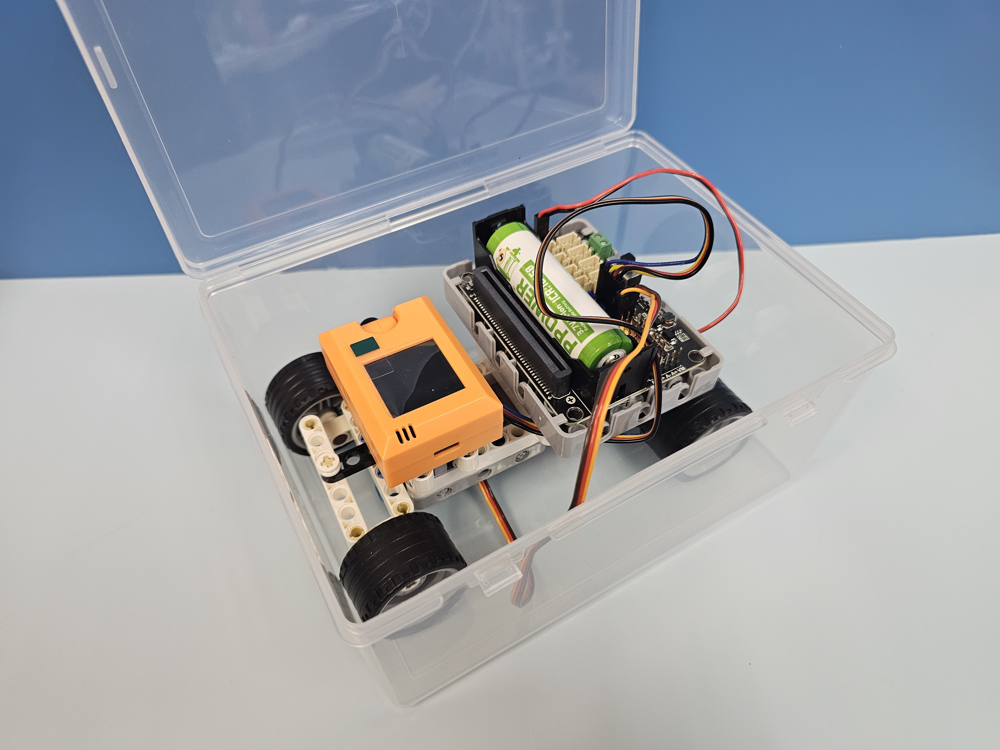

# 升級案例 KOI 2自動導航泊車

<figure><figcaption></figcaption></figure>

只要在Robotbit差速車的基礎上加上KOI 2，就可以做到自動追蹤路牌完成泊車動作的機械車。

## 套件特色

* 仿真機械車底盤
  * 配有差速器傳動系統及仿真轉向結構
  * 同學透過組裝小車可以學習到汽車的運作原理
* 自動導航駕駛
  * 透過選配的KOI 2，可以辨認路牌做到自動泊車的操作
* 附隨收納盒
  * 組裝完成的小車可以收納到盒子裡面

## 套件內容

* Robotbit 2.2擴展板 \*1
* Geekservo 2KG 馬達 \*1
* Geekservo 9G 舵機 \*1
* 積木包 \*1
* 18650鋰電池 \*1
* 塑膠收納盒 \*1
* KOI 2 AI鏡頭\*1&#x20;

## 套件包裝

<figure><figcaption></figcaption></figure>

 

<figure><figcaption></figcaption></figure>

<figure><figcaption></figcaption></figure>

 

<figure><figcaption></figcaption></figure>

## 說明書與參考程式


[autoparking\_tutorial.md](autoparking\_tutorial.md)


## 示範短片




