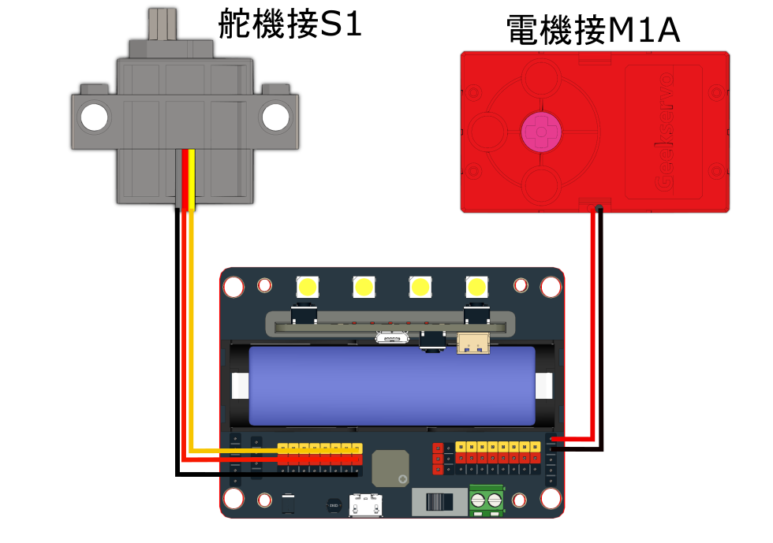

# 差速遙控小車 搭建說明書與參考程式

<figure><figcaption></figcaption></figure>

## 搭建說明書

<figure><figcaption></figcaption></figure>



## 參考程式

### 控制器



[參考程式](https://makecode.microbit.org/\_fxfFkM6vydtk)

### 差速遙控小車



[參考程式](https://makecode.microbit.org/\_gRd2Ay75qPwd)
