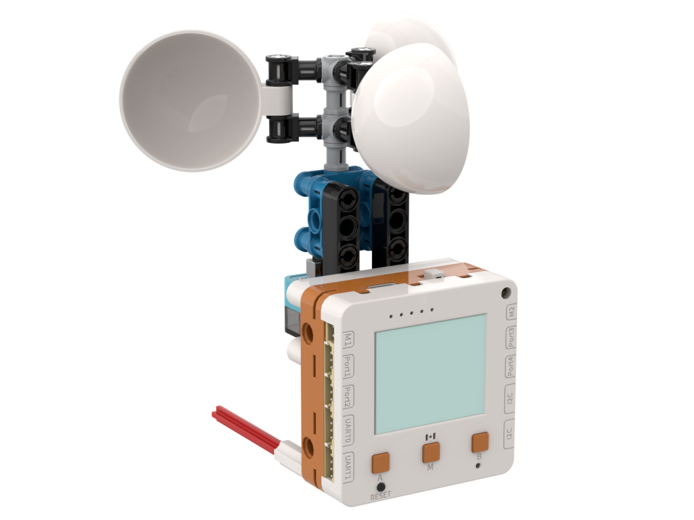
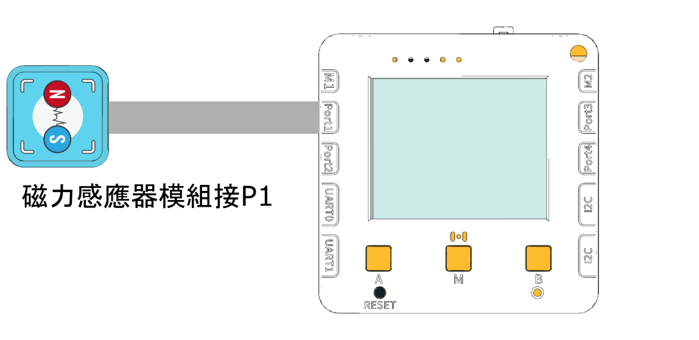

# 風速計Anemometer

<figure><figcaption></figcaption></figure>

## 硬件接線

<figure><figcaption></figcaption></figure>

## 搭建說明書



## 開啟程式

<figure><figcaption></figcaption></figure>

請同學在未來板Lite上開啟「Anemometer\_p1.py」檔案。



## 進行測量

未來板Lite會一直顯示測量到的風速(m/s)。

<figure><figcaption></figcaption></figure>

## 參考程式


