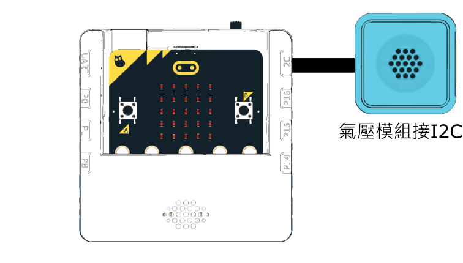

# 氣壓計Barometer

<figure><figcaption></figcaption></figure>

## 硬件接線

<figure><figcaption></figcaption></figure>

## 開啟程式

請同學在未來板Lite上開啟「HPA\_i2c.py」檔案。



## 進行測量

未來板Lite會一直顯示測量到的氣壓讀數(hpa)。

<figure><figcaption></figcaption></figure>

## 參考程式


