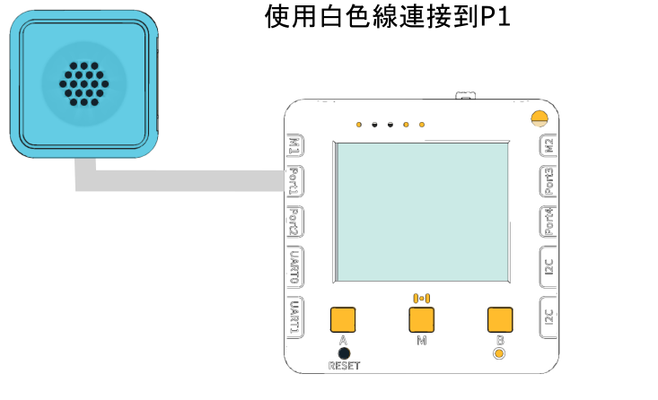

# 分貝計Decibel Sensor

<figure><figcaption></figcaption></figure>

<figure><figcaption></figcaption></figure>

## 硬件接線

<figure><figcaption></figcaption></figure>

## 開啟程式

請同學在未來板Lite上開啟「Sound\_p1.py」檔案。

<figure><figcaption></figcaption></figure>



## 進行測量

未來板Lite會一直顯示測量到的分貝(dB)。

<figure><figcaption></figcaption></figure>
