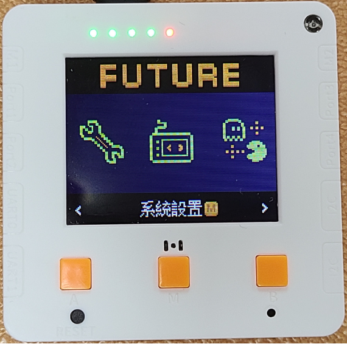
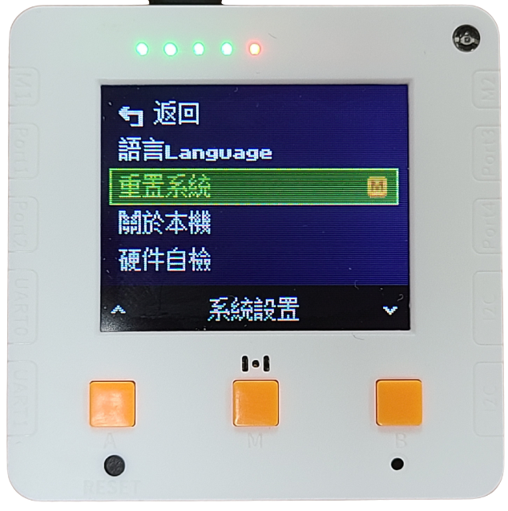
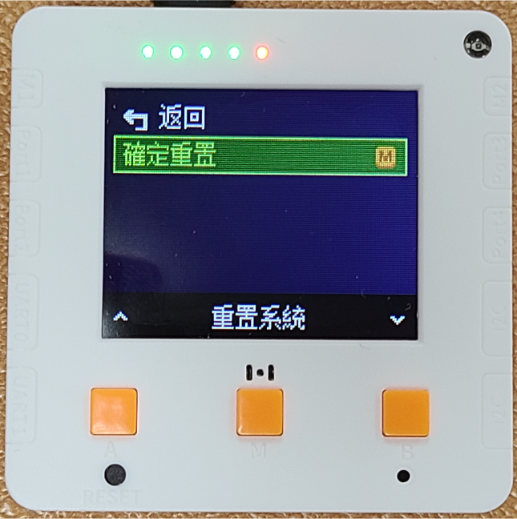

# 未來板Lite AI 程式復原教學

假如你的未來板Lite需要復原科學測量套件的預載程式，請參考以下教學將未來板恢復至出廠狀態。

## 1. 重設未來板系統

<figure><figcaption></figcaption></figure> <figure><figcaption></figcaption></figure> <figure><figcaption></figcaption></figure>

## 2. 用USB線將未來版連接到電腦，電腦會顯示USB Drive這個移動硬碟

<figure><figcaption></figcaption></figure>

## 3. 下載google drive所有檔案然後複製到Future移動硬碟上

### 下載範例程式

<figure><figcaption></figcaption></figure>

## 4. 記住要打開wifi.txt設定wifi登入資料
