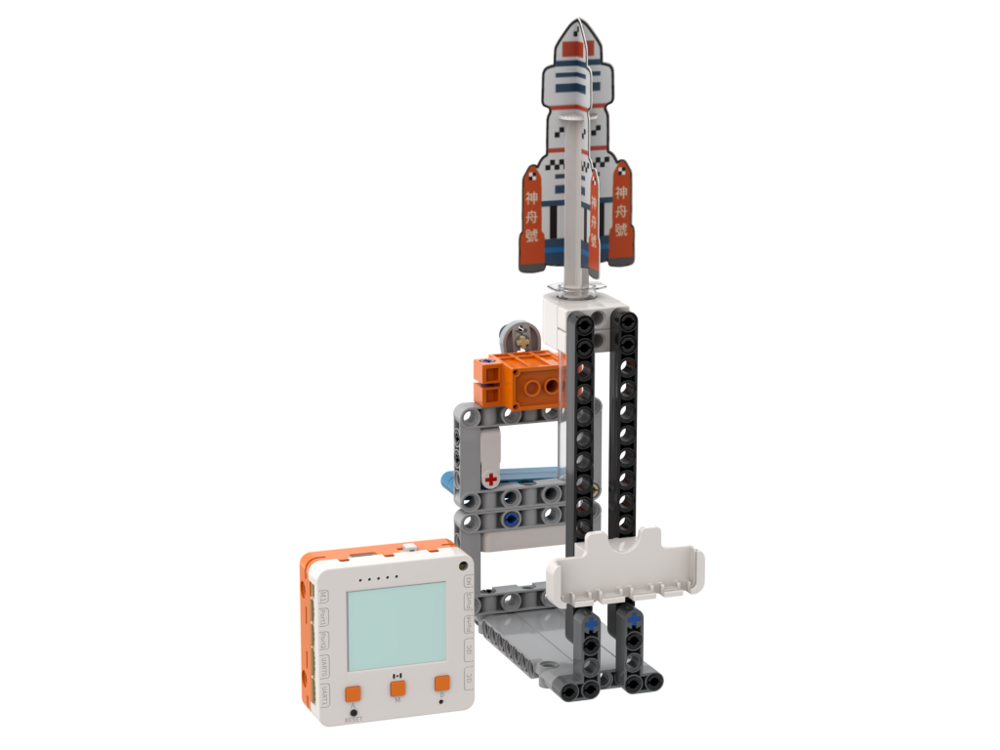

# 火箭發射器Air Rocket

<figure><figcaption></figcaption></figure>

## 硬件接線

<figure><figcaption></figcaption></figure>

## 搭建說明書


只需使用1-23頁的內容




## 開啟程式

請同學在未來板Lite上開啟「rocket\_m1.py」檔案。



## 發射火箭

按下A鍵啟動電機，等待火箭發射。按B鍵停止電機。
