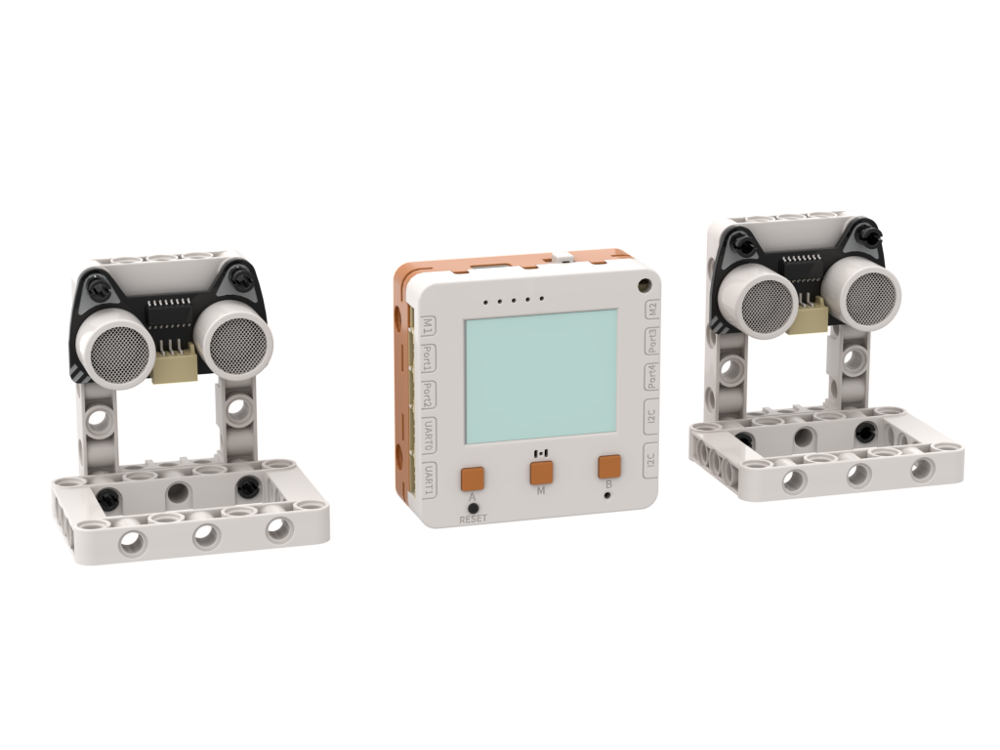
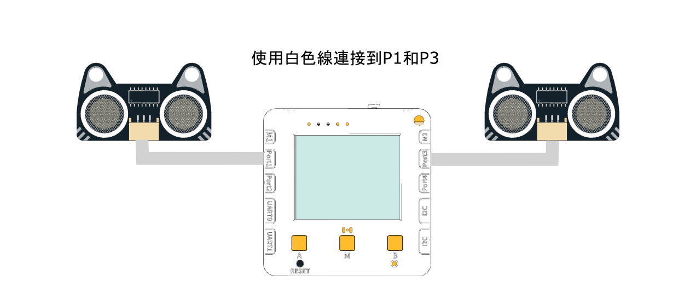

# 速度計Speedometer

<figure><figcaption></figcaption></figure>

## 硬件接線

<figure><figcaption></figcaption></figure>

## 搭建說明書



## 開啟程式

請同學在未來板Lite上開啟「speed\_p1\_p3.py」檔案。



## 進行測量

未來板Lite會一直顯示測量到的速度(m/s)。
