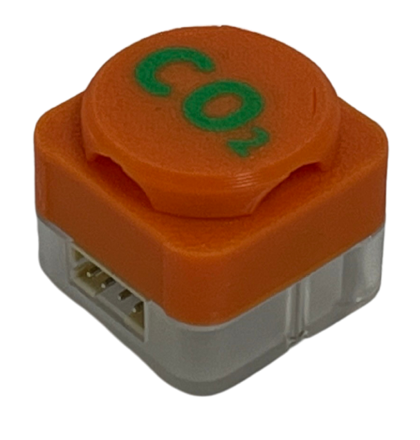
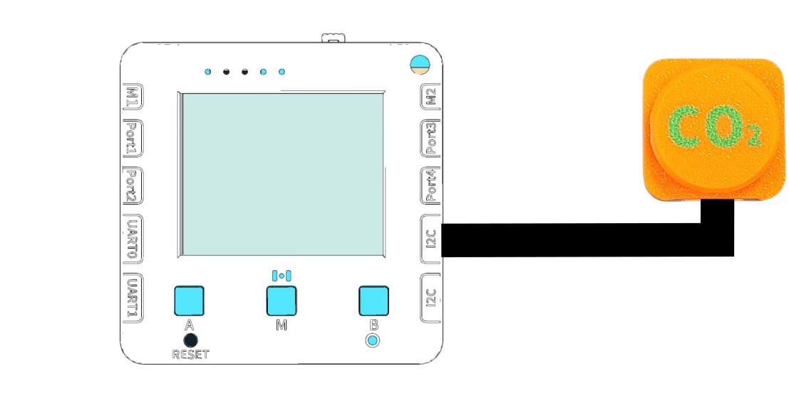

# 二氧化碳檢測CO2 Sensor

<figure><figcaption></figcaption></figure>

## 硬件接線

請同學將二氧化碳測量儀器連接到未來板Lite顯示板上。

<figure><figcaption></figcaption></figure>

## 開啟程式

請同學在未來板Lite上開啟「03\_CO2\_i2c.py」檔案。

<figure><figcaption></figcaption></figure>



## 進行測量

未來板Lite會一直顯示測量到空氣中的二氧化碳濃度(ppm)。

<figure><figcaption></figcaption></figure>

#### Datalogging頁面


未來板IP地址/html/co2.html


<figure><figcaption></figcaption></figure>

數據儲存在co2data資料夾

<figure><figcaption></figcaption></figure>

