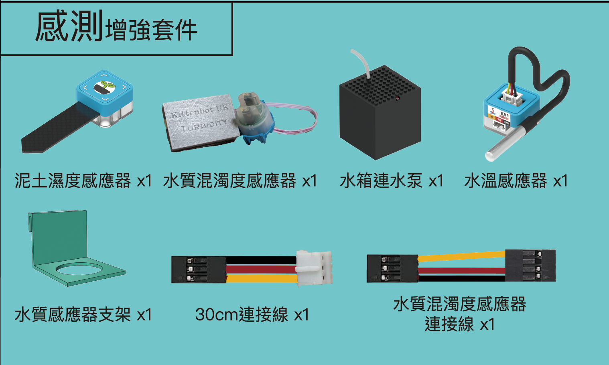

# 感測擴展

<figure><figcaption></figcaption></figure>


[soil.md](../../functional\_modules/sugar/soil.md)



[waterpump.md](../../functional\_modules/waterpump.md)



[watertemp.md](../../functional\_modules/sugar/watertemp.md)



[turbidity.md](../../functional\_modules/turbidity.md)

