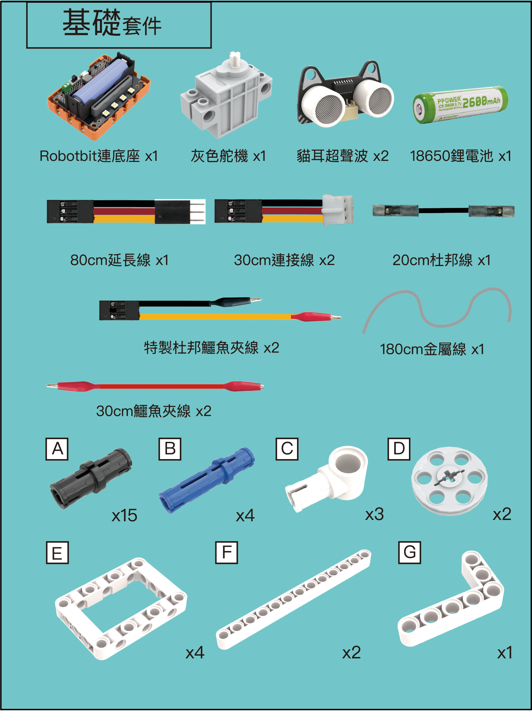

# 基礎啟動

<figure><figcaption></figcaption></figure>


[robotbit-2.2](../../../expansion\_board/robotbit-2.2/)



[geekservo9g\_servo.md](../../../actuators/geekservo9g\_servo.md)



[ultrasound.md](../../../functional\_modules/ultrasound.md)

