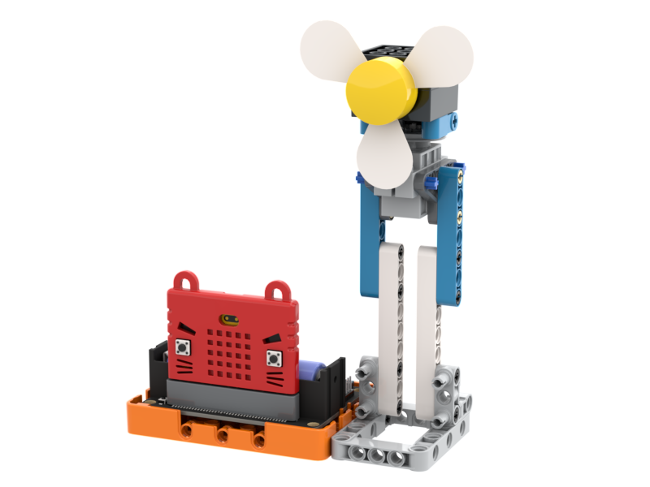

# 恒温風扇

### 組裝說明書下載

[組裝說明書下載](https://drive.google.com/drive/folders/1wg_edUZFrqyUONA0FJ6vFBkGArRsfnf4?usp=sharing)

### 參考程式



[參考程式下載](https://makecode.microbit.org/_ctHfvxAjsdAw)

### 模型玩法

按下A啟動風扇，風扇會左右擺動，速度會自動按溫度調節，按下A暫停風扇。
