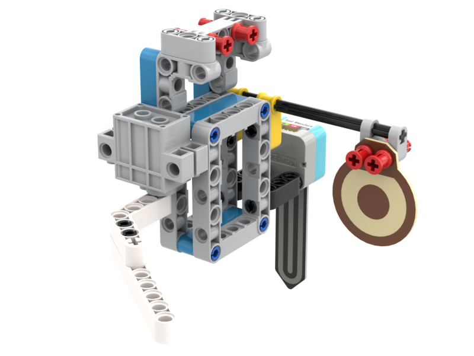

# 種植小助手

## 種植小助手

### 組裝說明書下載

[組裝說明書下載](https://drive.google.com/drive/folders/1wg_edUZFrqyUONA0FJ6vFBkGArRsfnf4?usp=sharing)

### 參考程式



[參考程式下載](https://makecode.microbit.org/_JPkV4gUKKYjU)

### 模型玩法

假如泥土過於乾燥，會敲響警告。
