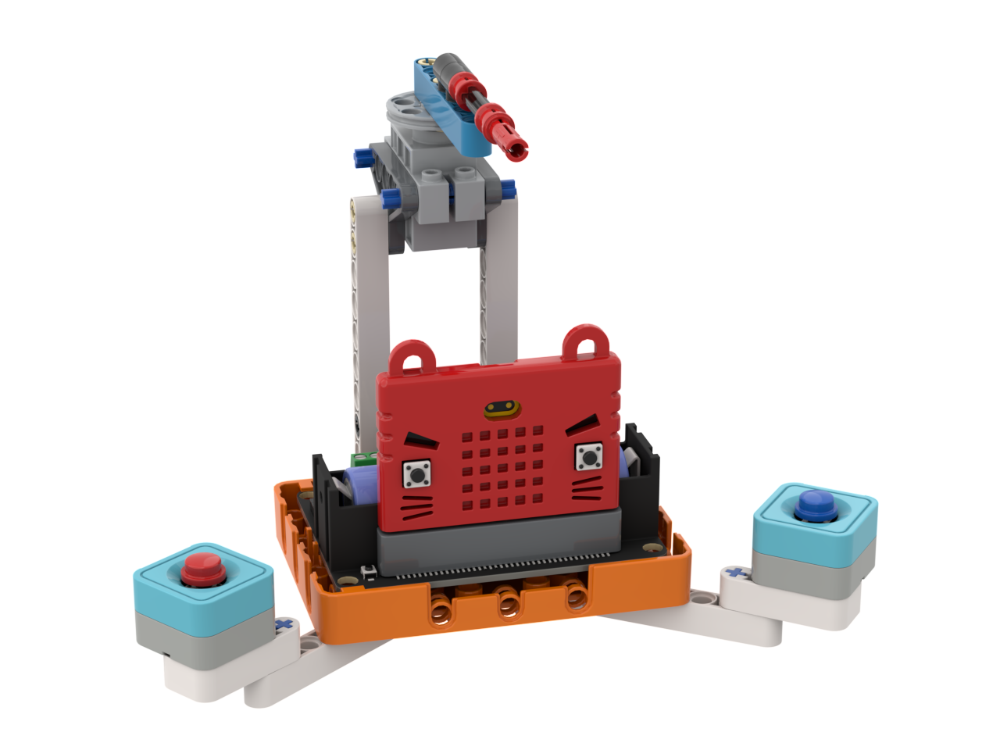

# 搶答機

### 組裝說明書下載

[組裝說明書下載](https://drive.google.com/drive/folders/1wg_edUZFrqyUONA0FJ6vFBkGArRsfnf4?usp=sharing)

### 參考程式



[參考程式下載](https://makecode.microbit.org/_WFcW5gHhA0Vu)

### 模型玩法

指針會指向最快按下按鍵的玩家。
