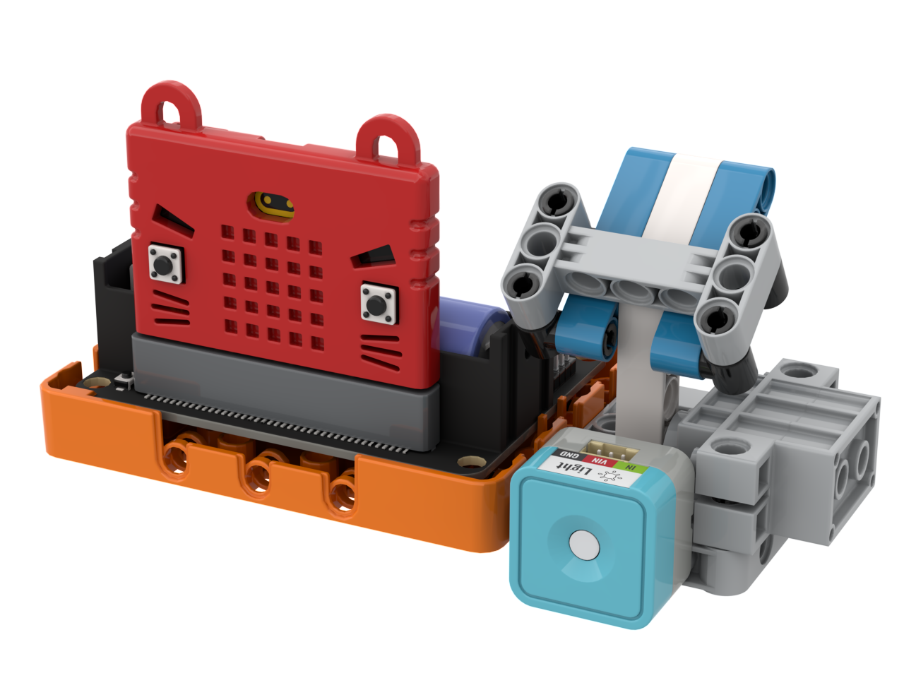

# 怕光殭屍

### 組裝說明書下載

[組裝說明書下載](https://drive.google.com/drive/folders/1wg_edUZFrqyUONA0FJ6vFBkGArRsfnf4?usp=sharing)

### 參考程式



[參考程式下載](https://makecode.microbit.org/_TTWM7o6TCPmt)

### 模型玩法

使用電筒照住殭屍的遊戲。

[Next ](https://kittenbothk.readthedocs.io/en/latest/Kits/classroom_inventor/instructions/kart_auto.html)[ Previous](https://kittenbothk.readthedocs.io/en/latest/Kits/classroom_inventor/instructions/fan.html)\
