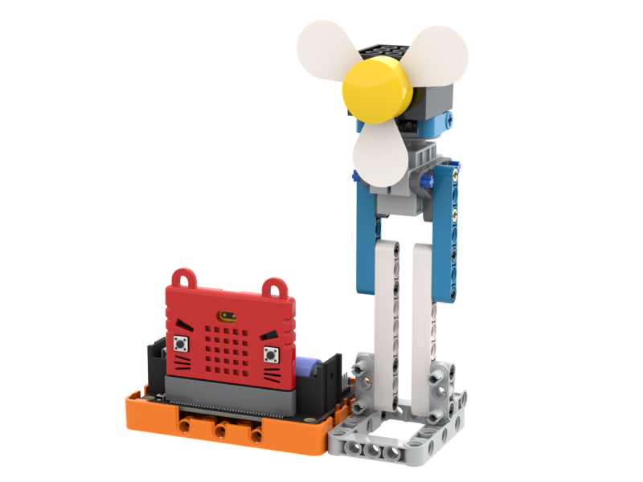
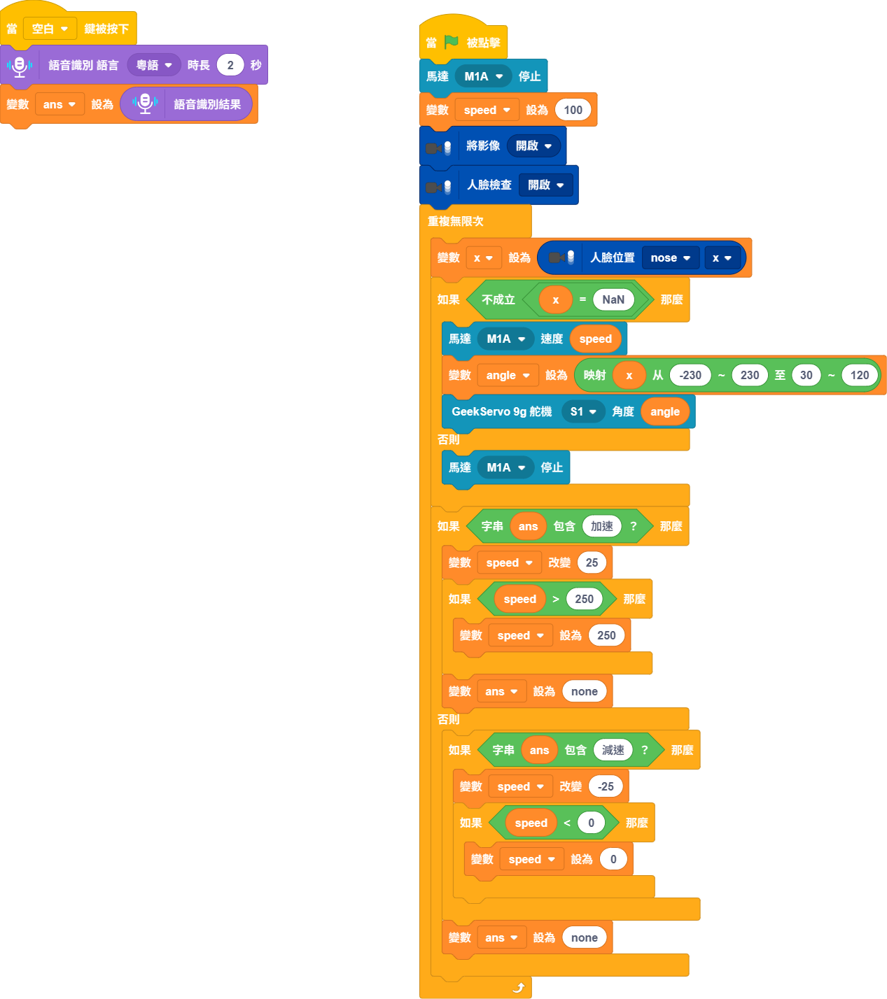

# 人面追蹤風扇

使用人面追蹤功能追蹤人面，自動將風扇指向人面。另外可以透過語音辨識調較風扇的速度。

### 組裝說明書下載

[組裝說明書下載](https://drive.google.com/drive/folders/1wg_edUZFrqyUONA0FJ6vFBkGArRsfnf4?usp=sharing)

.png>)

### 參考程式




這應用需要使用Token。


<figure><figcaption></figcaption></figure>

### 應用玩法


這應用需要使用Token。


1. 連接好Micro:bit和打開Robotbit電源
2. 點擊綠色旗啟動程式
3. 系統會自動追蹤鏡頭裡面的人面，並將風扇指向人面。
