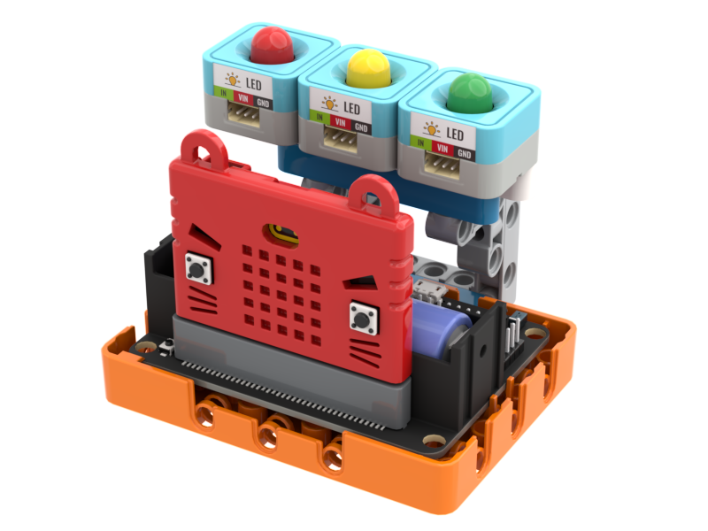

# 生日快樂

<figure><figcaption></figcaption></figure>

透過語音辨識，當聽到生日快樂祝福的時候，程式就會祝賀用戶生日快樂，並且透過人面辨識技術辨識用戶的年齡和性別，由大語言機械人生成相應的祝福說話再經過文字轉語音技術向用戶讀出祝福語。

### 組裝說明書下載

[組裝說明書下載](https://drive.google.com/drive/folders/1wg_edUZFrqyUONA0FJ6vFBkGArRsfnf4?usp=sharing)

### 參考程式



<figure><figcaption></figcaption></figure>

### 應用玩法


這應用需要使用Token。


1. 連接好Micro:bit和打開Robotbit電源
2. 點擊綠色旗啟動程式
3. 按下空白鍵進行語音辨識，當程式辨識到Happy Birthday語句後就會播放生日歌旋律
4. 程式會進行一次人面辨識，然後按照人面的性别年齡生成相應的祝賀語
