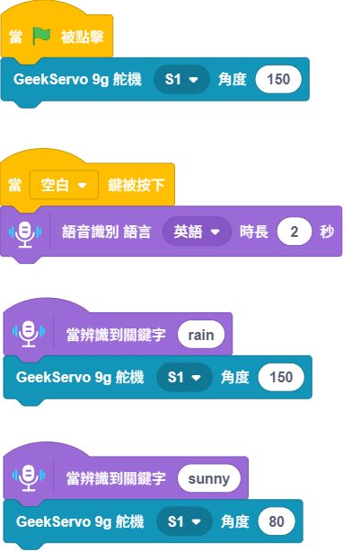

# 聲控衣架

透過KittenBlock的語音辨識功能，可以做到辨識到某個文字就控制衣架的應用。

### 組裝說明書下載

[組裝說明書下載](https://drive.google.com/drive/folders/1wg_edUZFrqyUONA0FJ6vFBkGArRsfnf4?usp=sharing)

### 參考程式




這應用需要使用Token。


<figure><figcaption></figcaption></figure>

### 應用玩法


這應用需要使用Token。


1.
