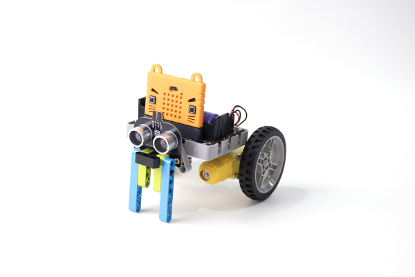
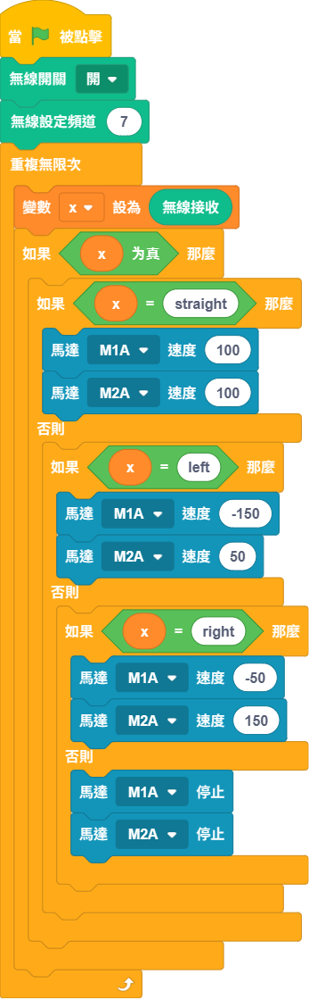
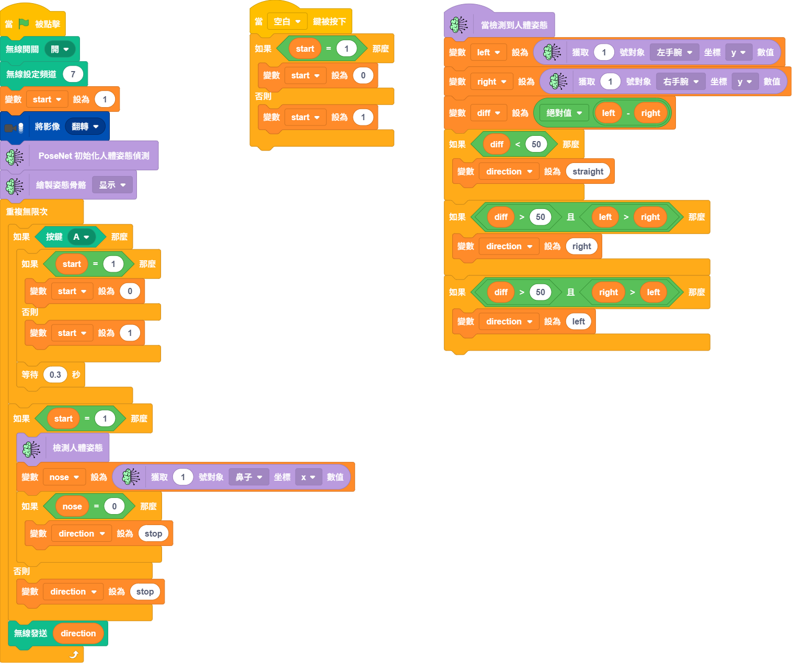

# 手勢控制小車

透過PoseNet肢體檢測模型，辨識到左手和右手的位置從而控制小車方向。

### 組裝說明書下載

[組裝說明書下載](https://drive.google.com/drive/folders/1wg_edUZFrqyUONA0FJ6vFBkGArRsfnf4?usp=sharing)

### 參考程式 小車接收


將此程式下載到機械車的Micro:bit上




<figure><figcaption></figcaption></figure>


打開代碼模式然後按上陣，等待完成上傳程式到Micro:bit


<figure><figcaption></figcaption></figure>

### 參考程式 小車遙控



<figure><figcaption></figcaption></figure>

### 應用玩法

1. 連接好Micro:bit和打開Robotbit電源
2. 點擊綠色旗啟動程式
3. 鏡頭會追蹤人體，將左右手的拳頭放在鏡頭裡面做出握著方向盤的姿勢
4. 當雙手高度大致水平，小車就會向前行駛
5. 當其中一隻拳頭明顯較高，小車就會轉向

