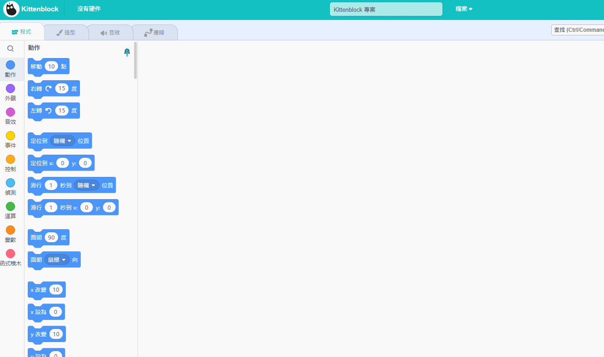
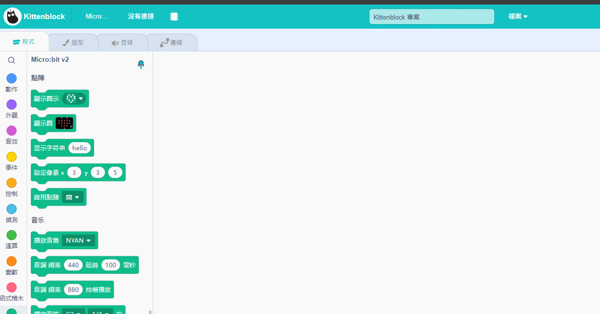
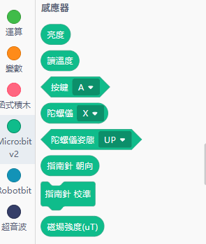

# Microbit V2與KittenBlock 快速教學

要在Kittenblock上使用Microbit的話必須按照教學，連接Microbit並更新固件。

## 前往在線版KittenBlock



## 在硬件欄選擇Micro:bit V2

<figure><figcaption></figcaption></figure>

## 使用USB線連接Micro:bit

<figure><figcaption></figcaption></figure>

## 更新固件


Microbit背面的LED會閃黃燈，請耐心等待黃燈停止閃鑠。


<figure><figcaption></figcaption></figure>

<figure><figcaption></figcaption></figure>

## 測試連接

試試點擊Microbit積木欄的積木，如Microbit即時有反應就代表固件已經成功更新

<figure><figcaption></figcaption></figure>

<figure><figcaption></figcaption></figure>
