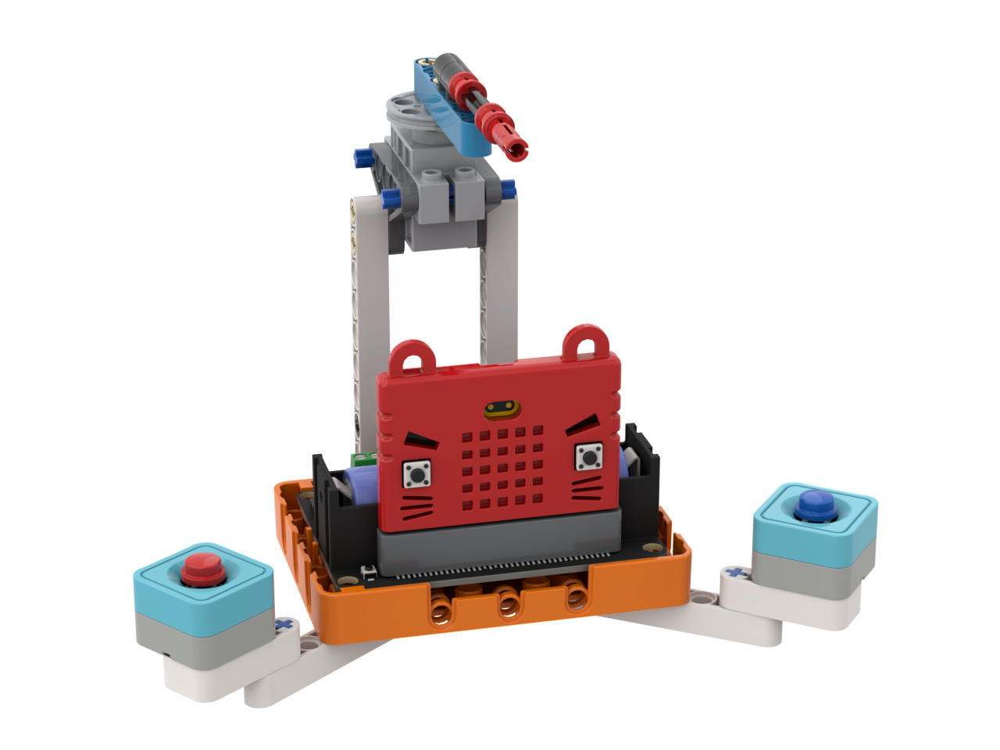

# 搶答機

### 組裝說明書下載

[組裝說明書下載](https://drive.google.com/drive/folders/1wg_edUZFrqyUONA0FJ6vFBkGArRsfnf4?usp=sharing)

### 參考程式



<figure><figcaption></figcaption></figure>

### 應用玩法


這應用需要使用Token。


1. 連接好Micro:bit和打開Robotbit電源
2. 點擊綠色旗啟動大模型機械人
3. 按空白鍵開始1次遊戲
4. 過了3-7秒之後，Micro:Bit會發出聲響然後程式會以語音描述一個水果
5. 兩個玩家要鬥快按下Sugar按鍵，指針會指向較快的用家
6. 玩家需要說出該水果的名稱，假如答對就會加分，答錯就會扣分
