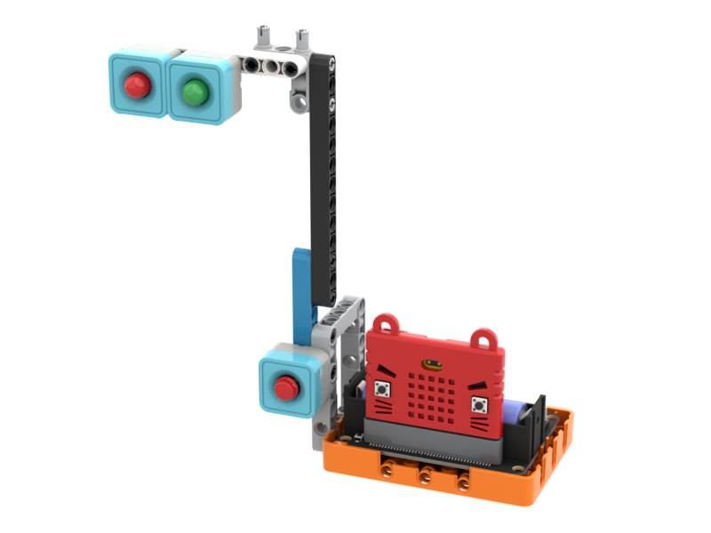

# 智慧道路管理系統

### 組裝說明書下載

[組裝說明書下載](https://drive.google.com/drive/folders/1wg_edUZFrqyUONA0FJ6vFBkGArRsfnf4?usp=sharing)

<figure><figcaption></figcaption></figure>

<figure><figcaption></figcaption></figure>

打開影像分類，使用teachable machine訓練模型


記住模型訓練後要將訓練項目導出儲存以供之後使用


<figure><figcaption></figcaption></figure>

### 參考程式 - 模型運行



<figure><figcaption></figcaption></figure>

### 應用玩法

1. 連接好Micro:bit和打開Robotbit電源
2. 點擊綠色旗啟動程式
3. 將八達通卡圖樣放在鏡頭面前，按下Sugar按鍵
4. 系統就會辨認圖像，如果辨認結果為old，程式就會給予10秒過路時間
5. 否則程式就會給予5秒過路時間

