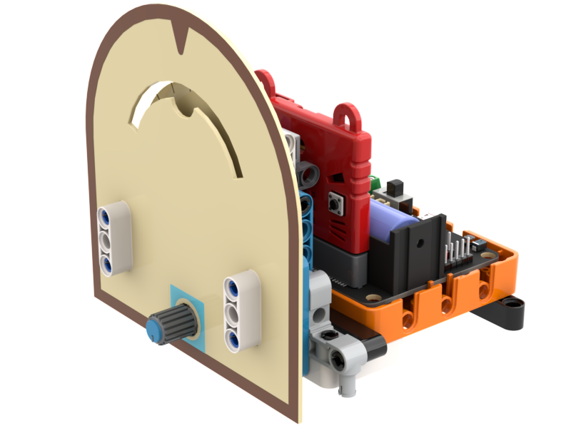

# Wordle密碼鎖

### 組裝說明書下載

[組裝說明書下載](https://drive.google.com/drive/folders/1wg_edUZFrqyUONA0FJ6vFBkGArRsfnf4?usp=sharing)

### 參考程式



<figure><figcaption></figcaption></figure>

### 應用玩法


這應用需要使用Token。


1. 連接好Micro:bit和打開Robotbit電源
2. 按空白鍵生成題目
3. 按綠色旗啟動程式
4. 使用Sugar旋轉電位器選擇字母，按Sugar按鍵確認按鍵
5. 完成輸入五個字母之後，程式會給予每個字母的提示
   1. 綠色: 字母正確
   2. 黃&#x8272;_:_ 字母的位置不正確
   3. 紅色: 字母不正確
6. 答案正確的話Microbit會播放音效
