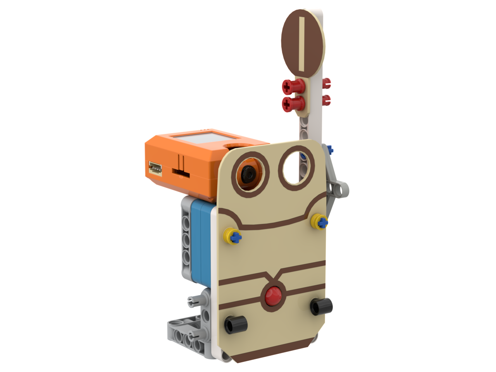
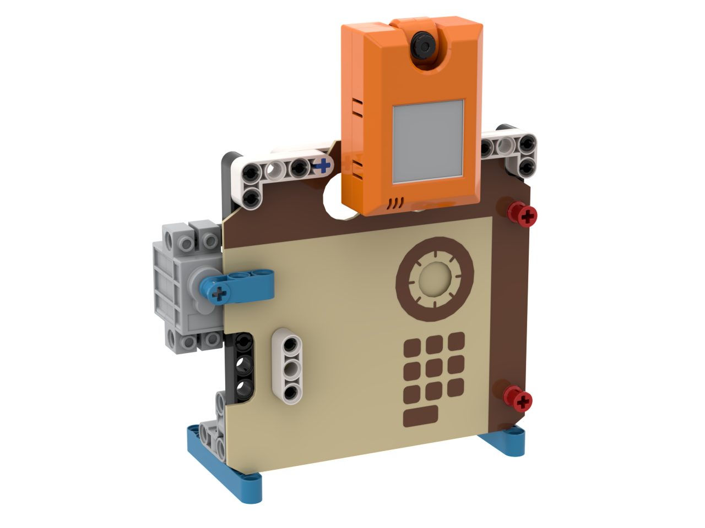
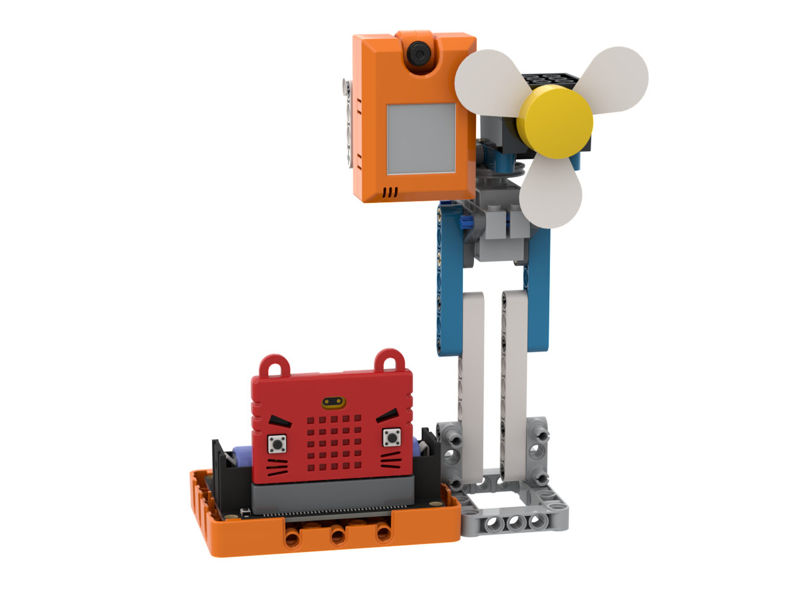
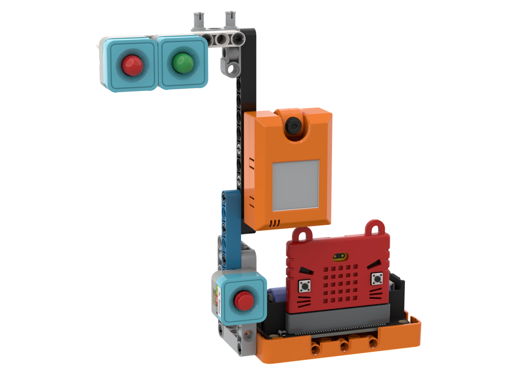
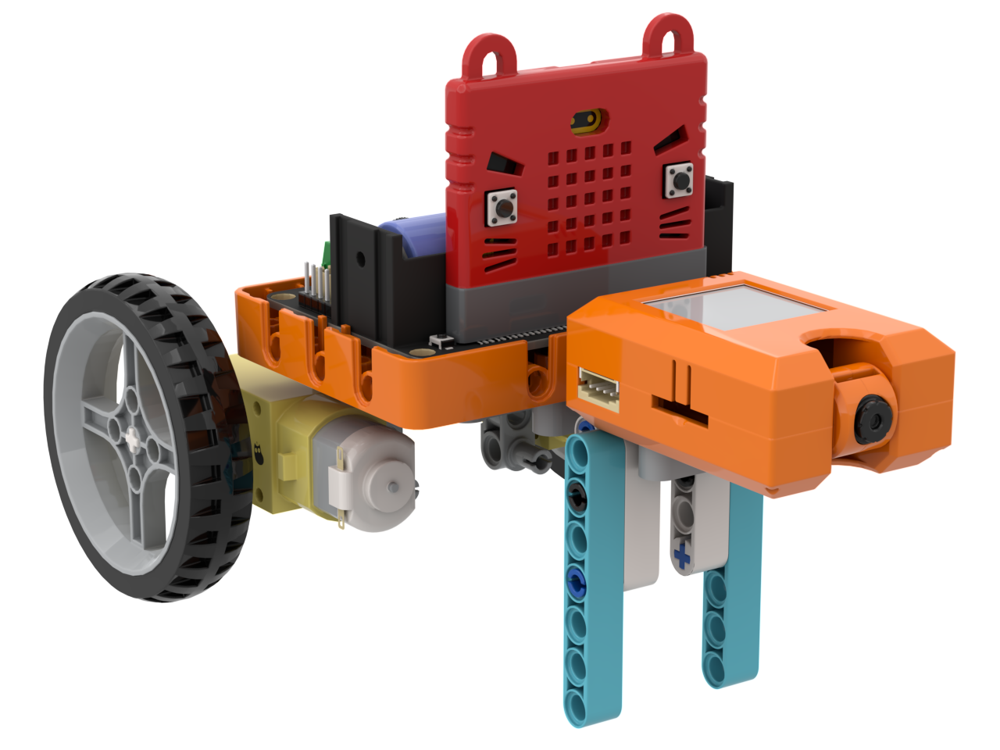

# Micro:bit 發明家套件 KOI 2 升級案例

發明家套件可以加上KOI 2，將5款案例進行AI升級。



### 口罩偵測閘門

<figure><figcaption></figcaption></figure>


[kou-zhao-zhen-ce-zha-men.md](kou-zhao-zhen-ce-zha-men.md)


### 人面圖像辨識保險箱

<figure><figcaption></figcaption></figure>


[ren-mian-tu-xiang-bian-shi-bao-xian-xiang.md](ren-mian-tu-xiang-bian-shi-bao-xian-xiang.md)


### 人面追蹤風扇

<figure><figcaption></figcaption></figure>


[ren-mian-zhui-zong-feng-shan.md](ren-mian-zhui-zong-feng-shan.md)


### AI 道路管理系統

<figure><figcaption></figcaption></figure>


[ai-dao-lu-guan-li-xi-tong.md](ai-dao-lu-guan-li-xi-tong.md)


### 自動駕駛小車

<figure><figcaption></figcaption></figure>


[zi-dong-jia-shi-xiao-che.md](zi-dong-jia-shi-xiao-che.md)

