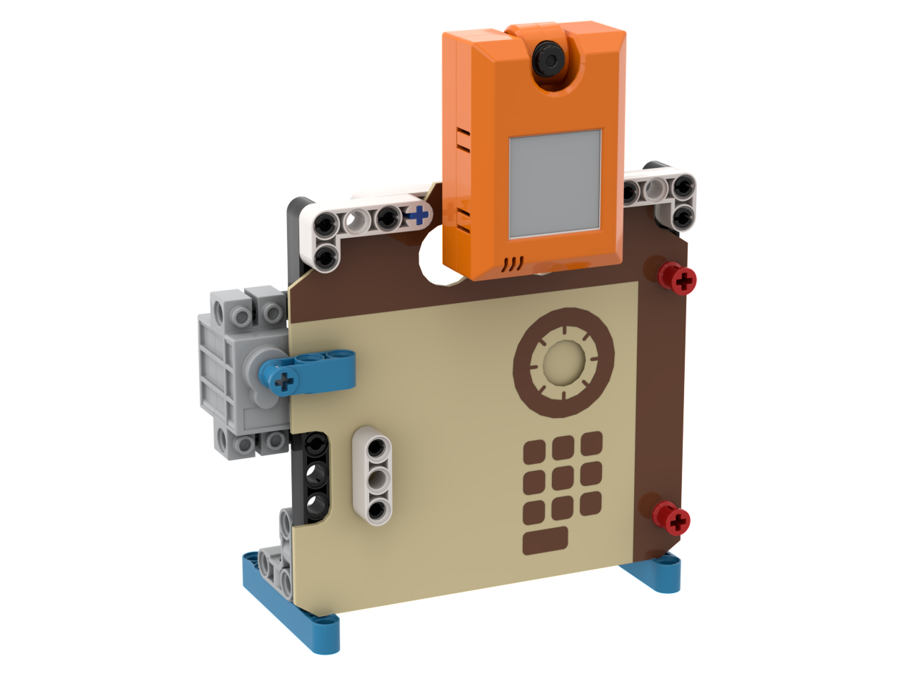

# 人面圖像辨識保險箱

### 組裝說明書下載



### 參考程式

#### 訓練程式



[參考程式下載](https://makecode.microbit.org/\_F2y6qgayXgJC)

#### 主程式



[參考程式下載](https://makecode.microbit.org/\_JYafdPHqqagq)

### 模型玩法

首先使用訓練程式，按A對人面進行訓練。完成後按B儲存模型。

然後用主程式，按A+B載入模型。按A進行辨認，假如辨認成功就會打開保險箱。之後按B上鎖。
