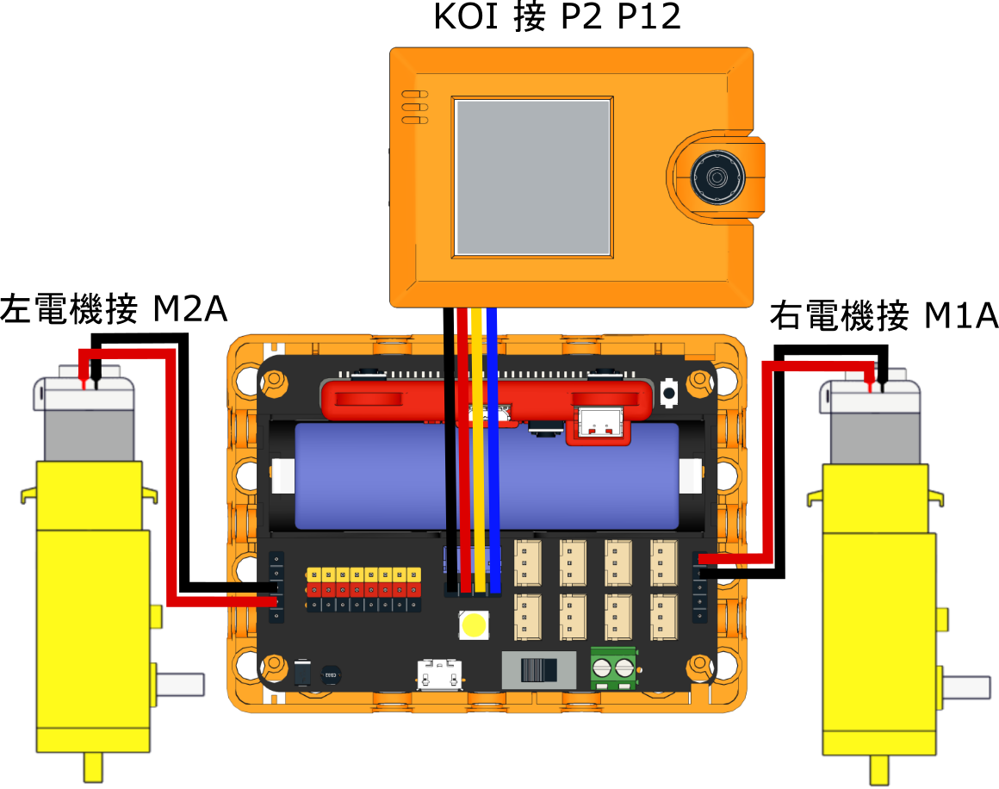

# 自動駕駛小車

<figure><figcaption></figcaption></figure>

### 組裝說明書下載

<figure><figcaption></figcaption></figure>



### 參考程式



[參考程式下載](https://makecode.microbit.org/\_5w7Mwb19Ydv3)

### 模型玩法

1. KOI小車會自動追蹤路牌，見到前行／左轉／右轉的路牌時就會行駛。
