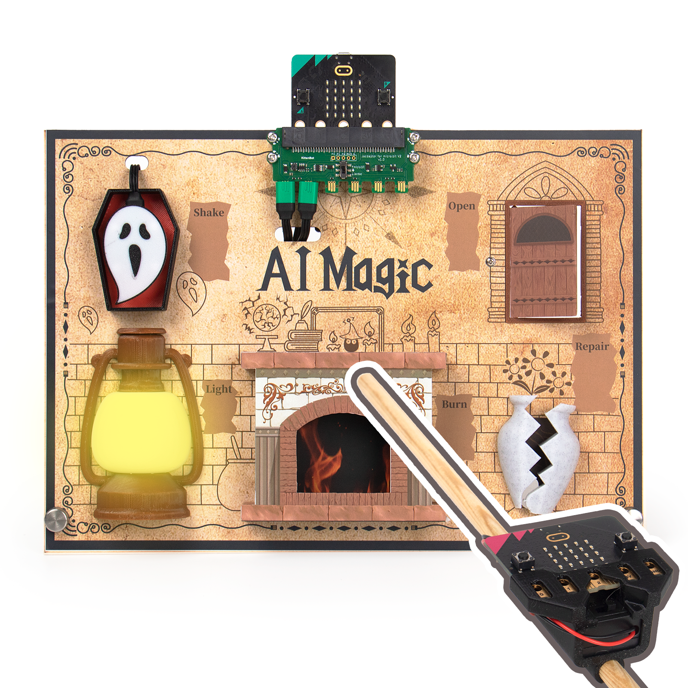
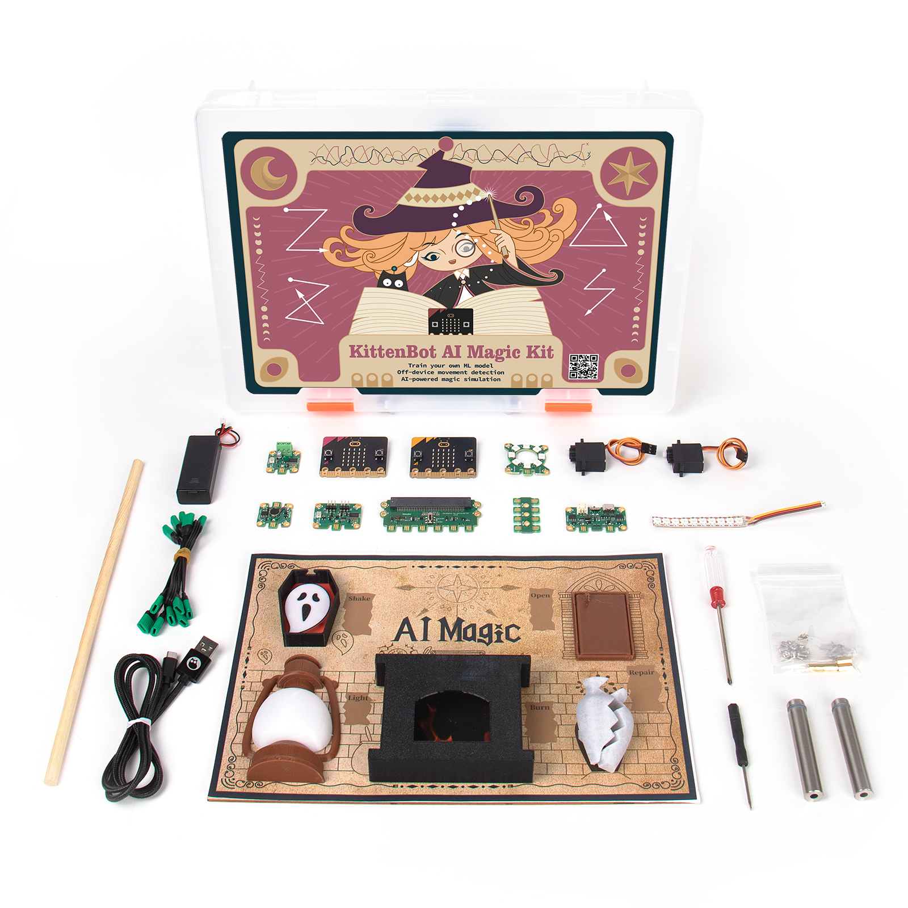

# Jacdac Micro:bit AI巫師

<figure><figcaption></figcaption></figure>

訓練AI辨識手勢，化身小巫師施展魔咒。魔咒效果透過Jacdac模組活靈活現。

學生代入小巫師角色，學習更投入。配合美觀的道具，展示性更高。

## 套件特色

* 訓練AI模型過程簡易
* 玩法融合AI與魔法，學生更投入
* MakeCode全圖像化編程
* 可自訂咒語
* 道具美觀，展示性高
* 採用Jacdac系列，接線及編程簡單

## 套件內容

**電子模組**

* Jacdaptor x1
* Jacdac-Power x1
* Jacdac-Hub\_b x1
* Jacdac-RGB Strip x1
* 10 Pixels Flexible Light Strips x1
* Jacdac-Servo x1
* GeekServo 9G Servo x2
* Jacdac-Haptic Output x1
* Jacdac-RGB Ring x1
* battery pack x1

**Cable**

* microUSB 1m x1
* Type-C 1m x1
* Jacdac Cable 10cm x3
* Jacdac Cable 35cm x3

**Additional Components**

* Wooden board ( 210mm × 297mm × 3mm) x1
* Wooden Stick ( 300mm, φ8mm) x1
* 3D Printed Part
* Stickers
* 1cm Round Double
* Sided Tape (Sheet)
* Brass Standoff x4
* Screws m3 x10
* Screws m2 x8
* Screws m1.2x6 x4
* Screwdriver x1

## 展示短片



## 產品展示

<figure><figcaption></figcaption></figure>

<figure><figcaption></figcaption></figure>

<figure><figcaption></figcaption></figure>

<figure><figcaption></figcaption></figure>
