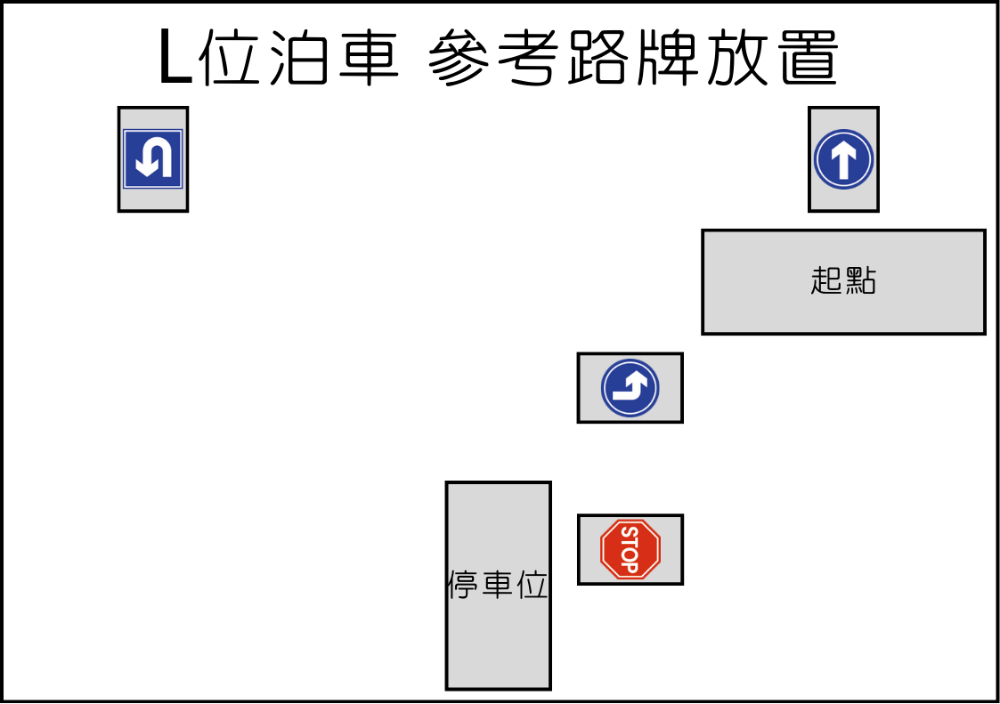
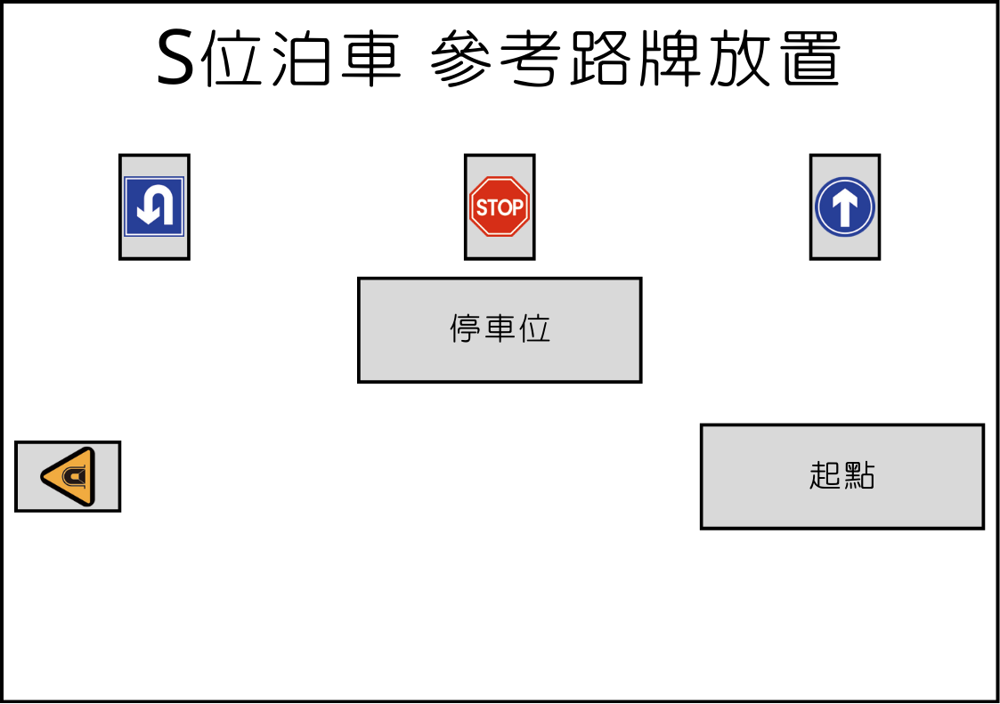

# 說明書與參考程式

## 路牌圖檔



## 搭建說明書



## 接線圖

<figure><figcaption></figcaption></figure>

## 參考程式

### L位自動導航泊車

<figure><figcaption></figcaption></figure>



[參考程式](https://makecode.microbit.org/\_J3w4EKa9K6rr)

### S位自動導航泊車

<figure><figcaption></figcaption></figure>



[參考程式](https://makecode.microbit.org/\_AR464iCuxFyC)
