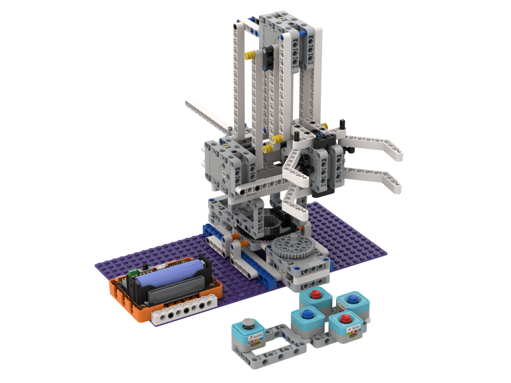

# 工業4.0機械臂

工業4.0機械臂是一套機械套件，套件可以搭建出一隻以5隻Geekservo 2KG舵機驅動的活動機械臂。

### 套件內容

#### 普通版(有線控制)

1. Robotbit Edu x1
2. 18650鋰電池 x1
3. Geekservo 2KG舵機 x5
4. Sugar 按鍵模組 x4
5. Sugar 搖桿模組 x1
6. 積木包
7. 連接線
8. 舵機延長線 x4

#### 豪華版(無綫控制)

* Robotbit Edu x1
* 18650鋰電池 x1
* Geekservo 2KG舵機 x5
* 積木包
* 舵機延長線 x4
* Joyfrog x1

### 套件特色

* 採用2KG舵機，確保機械臂運作更加穩定可靠
* 機械結構讓學生了解機械臂例如槓桿力學等的機械工程知識
* 動手搭建，讓學生動手組裝機械臂，提升工程技能
* 採用積木結構，靈活改裝適合不同應用

### 示範短片



[示範短片](https://youtu.be/8Yhz4D-pZ-0)
